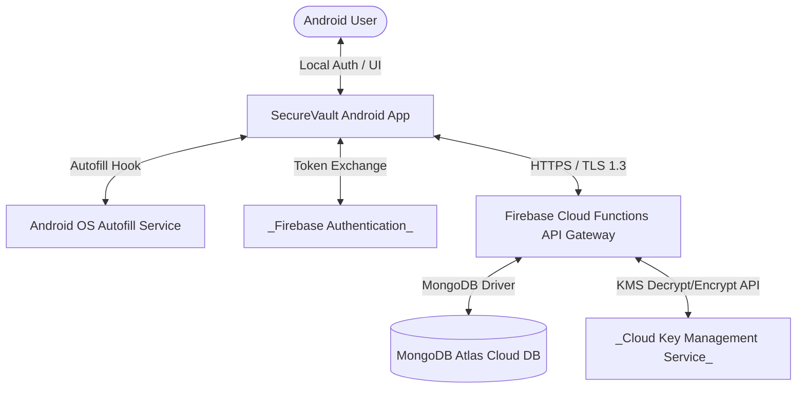

# SECUREVAULT - SYSTEM ARCHITECTURE DOCUMENT

---

## 1. Architecture Style

SecureVault utilizes a **Mobile MVVM Client + Serverless Backend Gateway** architectural pattern. 

```
┌───────────────────────────────────────────────────────────────────┐
│                          Mobile Client                            │
│ ┌───────────────┐     ┌───────────────┐     ┌───────────────────┐ │
│ │  UI Layouts   │ ──> │  ViewModels   │ ──> │    Repositories   │ │
│ └───────────────┘     └───────────────┘     └───────────────────┘ │
│                                                       │           │
│                                                       ▼           │
│                                             ┌───────────────────┐ │
│                                             │   Room DB +       │ │
│                                             │   SQLCipher Cache │ │
│                                             └───────────────────┘ │
└───────────────────────────────────────────────────────│───────────┘
                                                        │ HTTPS/REST
                                                        ▼
┌───────────────────────────────────────────────────────────────────┐
│                         Backend Services                          │
│                      ┌─────────────────────┐                      │
│                      │    Firebase Cloud   │                      │
│                      │    Functions API    │                      │
│                      └─────────────────────┘                      │
│                                 │                                 │
│                                 ▼                                 │
│                      ┌─────────────────────┐                      │
│                      │ MongoDB Atlas Cloud │                      │
│                      └─────────────────────┘                      │
└───────────────────────────────────────────────────────────────────┘
```

### Pattern Justification
1. **Team Size & Timeline Constraints**: A serverless backend eliminates operational overhead (no server patching, VM scaling, or system OS updates). Development efforts can be focused purely on client-side security and backend functional endpoints, meeting tight timelines.
2. **Vault Isolation Scale**: Since each vault is strictly mapped 1-to-1 to a Google Account, a shared database container (MongoDB Atlas) using logical user partitioning (`uid` key scoping) is highly scalable and matches the account system architecture.
3. **Offline-First Resilience**: An MVVM client using local Room caching coupled with SQLCipher lets users perform writes locally when offline, and automatically handles synchronization in the background when the network returns.

### Accepted Tradeoffs
* **Cold Start Latency**: Firebase Cloud Functions are susceptible to cold starts (delay of 1s to 3s if endpoints are inactive). This is accepted for sync operations, but is mitigated on auth/retrieval paths by displaying responsive loading screens.
* **Serverless Vendor Lock-in**: The backend gateway is highly coupled to Firebase project dependencies. If a migration is needed, functions will require refactoring to standard Node.js Express setups on other container clusters.

---

## 2. System Context Diagram (C4 Context Level)

The C4 context diagram maps all external systems and user actors:



---

## 3. Component Architecture (C4 Container Level)

The container diagram outlines client and server components and their operational specifications:

```mermaid
graph TD
    subgraph Client App Container (Kotlin)
        UI[UI View Layer - Material 3]
        VM[ViewModel Layer]
        Repo[Repository Layer]
        Room[Room SQLite DB]
        Cipher[(SQLCipher Wrapper)]
        Keystore[[Android Keystore]]
        Sync[WorkManager Sync Worker]
    end

    subgraph API Gateway Container (Node.js)
        Func[Firebase Cloud Functions]
    end

    subgraph Database Container
        DB[(MongoDB Atlas DB)]
    end

    UI <--> VM
    VM <--> Repo
    Repo <--> Room
    Room <--> Cipher
    Cipher <--> Keystore
    Repo <--> Sync
    Sync <-->|HTTPS REST| Func
    Func <--> DB
```

### Container Specifications

#### 1. UI View Layer
* **Technology**: Kotlin, Material 3
* **Responsibility**: Renders user interfaces and binds states to the user.
* **Inputs/Outputs**: Receives user inputs (clicks, text entries); outputs actions to ViewModels and receives display states.
* **Failure Behavior**: Gracefully logs runtime view bindings; displays empty state screens if database queries fail.

#### 2. ViewModel Layer
* **Technology**: Kotlin MVVM Architecture Components
* **Responsibility**: Holds UI-agnostic states and triggers background repository queries.
* **Inputs/Outputs**: Receives UI events; outputs LiveData/StateFlow streams.
* **Failure Behavior**: Retains state parameters across configuration changes (e.g. rotation).

#### 3. Repository Layer
* **Technology**: Kotlin repository pattern
* **Responsibility**: Manages data routing between local SQLCipher storage and the Sync Worker interface.
* **Inputs/Outputs**: Receives queries; outputs encrypted data models.
* **Failure Behavior**: Emits error flows to ViewModels if local caching fails.

#### 4. Room Database + SQLCipher Wrapper
* **Technology**: Room DB (v2.6.1) + SQLCipher (v4.5.4)
* **Responsibility**: Manages local persistent storage of password caches.
* **Inputs/Outputs**: Receives write/read database queries; outputs encrypted SQLite files.
* **Failure Behavior**: Aborts operations if DB keys are invalidated.

#### 5. Android Keystore
* **Technology**: Android Native Keystore API
* **Responsibility**: Manages hardware-backed encryption keys.
* **Inputs/Outputs**: Generates keys; outputs keys for SQLCipher database encryption.
* **Failure Behavior**: Invalidates biometric keys if a system-level fingerprint profile changes.

#### 6. WorkManager Sync Worker
* **Technology**: Android WorkManager (v2.9.0)
* **Responsibility**: Executes background queue synchronization when network is available.
* **Inputs/Outputs**: Receives network status notifications; triggers sync REST API calls.
* **Failure Behavior**: Retries sync jobs using exponential backoff.

#### 7. Firebase Cloud Functions Gateway
* **Technology**: Node.js v20 API gateway
* **Responsibility**: Handles routing, authenticates tokens, and updates database records.
* **Inputs/Outputs**: Receives REST requests; outputs JSON responses and queries MongoDB Atlas.
* **Failure Behavior**: Gateway remains active; returns 503 if database connection drops.

#### 8. MongoDB Atlas Cloud DB
* **Technology**: MongoDB Atlas v6.0+
* **Responsibility**: Cloud storage of vault records.
* **Inputs/Outputs**: Receives database operations; returns record payloads.
* **Failure Behavior**: Offline client changes queue up; client sync retries once database is back online.

---

## 4. Data Flows

This section details request and processing flows for all P0 features:

### 1. Google Sign-In & VMK Retrieval (F-AUTH-01)
* **Happy Path**:
  1. User clicks "Sign in with Google" in UI.
  2. UI calls Android `Credential Manager` API to retrieve Google ID Token.
  3. ID Token is verified on the backend API gateway (`Firebase Cloud Functions`).
  4. User is challenged with their Security Question. If valid, the gateway requests `Cloud KMS` to decrypt the VMK.
  5. API Gateway sends the decrypted VMK to the client over HTTPS (TLS 1.3).
  6. Client caches the VMK in RAM and registers the session in the hardware-backed `Android Keystore`.
* **Failure Path**:
  * *Step 4 Fail*: Wrong Security Question answer. API gateway blocks requests, increments failed counter, and returns `401 Unauthorized`. Client keeps user on login screen.

### 2. Local PIN Unlock (F-AUTH-03) & Lockout (F-AUTH-04)
* **Happy Path**:
  1. User inputs a 6-digit PIN on the lock screen.
  2. Client app validates the hash against the local SQLCipher password store.
  3. Upon match, local Room DB unlocks and dashboard renders.
* **Failure Path**:
  * *PIN Mismatch*: App increments local failed attempt counter.
  * *6-10 Attempts*: Client view introduces progressive entry delays (30s to 15m) and disables input fields.
  * *11+ Attempts*: Client locks PIN entry for 2 hours, writes the lockout state to database, and syncs this lockout state to the server backend database to prevent app reinstallation bypasses.

### 3. Password CRUD (F-VAULT-02) & In-Memory Encryption (F-SYNC-01)
* **Happy Path**:
  1. User adds a password entry in UI and clicks "Save".
  2. ViewModel forwards the plaintext data to Repository.
  3. Repository uses the cached VMK to encrypt the password field via AES-256-GCM.
  4. Repository writes the encrypted entry to local Room database.
  5. Entry is added to the local `Sync Queue` table with a state of `pending`.
* **Failure Path**:
  * *VMK Cache Cleared*: If VMK cache is missing (app terminated), the app forces re-authentication to re-encrypt and complete the transaction.

### 4. Background Sync Worker (F-SYNC-02) & Conflict Resolution (F-SYNC-03)
* **Happy Path**:
  1. Device recovers network connection.
  2. Android `WorkManager` triggers the background Sync Worker.
  3. Worker queries the local `Sync Queue` table for `pending` writes.
  4. Pushes changes via HTTPS REST payload to the Firebase gateway functions.
  5. Gateway validates JWT session token and updates MongoDB Atlas records.
  6. Worker pulls recent server-side changes and commits them to the local database, removing items from `Sync Queue`.
* **Failure Path**:
  * *Version Collision (Conflict)*: If the client version conflicts with the server version, the server compares the incoming client `updatedDate` with the server `updatedDate`. The later timestamp wins, and the loser is overwritten.

---

## 5. Infrastructure

### Hosting Topology
* The client runs locally on Android devices.
* The API Gateway is hosted on serverless **Firebase Cloud Functions** instances in the `us-central1` region (or the user-scoped regional cluster).
* Database hosting is a managed cloud cluster provided by **MongoDB Atlas** running across multiple availability zones.

### Inter-Component Communication
* **Client to Gateway**: HTTPS REST API over TCP port 443. Minimum TLS version: `TLS 1.2` (with `TLS 1.3` enforced by default).
* **Gateway to Database**: MongoDB database driver over secure TCP ports.
* **Gateway to Key Management**: REST calls using OAuth credentials to access GCP/AWS KMS services.

### Scalability
* **Firebase Functions**: Scales horizontally automatically based on API gateway demand.
* **MongoDB Atlas**: Auto-scales compute and storage resources dynamically to accommodate user traffic.
* **Client Device**: No server-side CPU/memory scaling impacts; encryption operations run entirely on the client processor.

### Caching
* **Client Favicons**: Website favicons are cached on local device storage (disk cache) with a TTL of 7 days.
* **Favicon Fetching Proxy**: The backend gateway acts as a caching proxy. It fetches and caches icons from websites, serving them to clients and preserving client privacy.

### Background Jobs
* **WorkManager Sync**:
  * *Trigger*: Scheduled dynamically when network connectivity shifts to online (`NetworkType.CONNECTED`).
  * *Failure Handling*: If connection drops mid-sync, the task aborts and reschedule retries execute using exponential backoff.

---

## 6. Mobile Architecture

### Architecture Pattern (MVVM)
SecureVault implements the standard Android MVVM architecture with Repository layers to decouple view presentation from local business logic:

```
┌─────────────────┐       ┌─────────────────┐       ┌─────────────────┐
│     Activity    │ ───>  │    ViewModel    │ ───>  │   Repository    │
│    (UI View)    │ <───  │   (UI States)   │ <───  │  (Data Source)  │
└─────────────────┘       └─────────────────┘       └─────────────────┘
                                                             │
                                                             ▼
                                                    ┌─────────────────┐
                                                    │  Room SQLCipher │
                                                    │  Local Storage  │
                                                    └─────────────────┘
```

* **Justification**: MVVM is natively supported by Google Jetpack, separates UI logic from background operations, and is highly testable using standard unit testing frameworks.

### State Management
* ViewModels manage screen-level UI states and expose them via Kotlin `StateFlow` and `SharedFlow` reactive streams.
* The View layer (Activities/Composables) binds to these flows to automatically update the UI when the underlying data changes.

### Offline Strategy
* **Offline Capabilities**: Reading passwords, searching, copying credentials, and editing/creating entries function completely offline.
* **Local Storage**: Data is cached in Room encrypted with SQLCipher.
* **Syncing**: A WorkManager queue synchronizes data when the network returns, using a hybrid conflict resolution model (version counter + timestamp compare).

---

## 7. Failure Modes

| Component | Failure Scenario | System Behavior | Recovery Mechanism |
| :--- | :--- | :--- | :--- |
| **Android Client** | SQLite database file corruption. | App UI catches initialization exception; displays safe restart prompt. | Local DB file is wiped; client forces re-authentication to retrieve vault from MongoDB Atlas. |
| **Android Keystore** | Biometric key invalidation. | App displays biometric error overlay and disables biometric login. | User must enter their PIN to unlock the app and re-enroll biometrics. |
| **API Gateway** | Firebase Cloud Functions downtime. | Client app logs timeout exception and switches to offline mode. | Local writes queue up in the `Sync Queue` table; WorkManager retries sync once gateway is online. |
| **MongoDB Atlas** | Database connection timeout. | Gateway returns `503 Service Unavailable` error responses to client. | Local writes are retained in Room cache; gateway database connection pools reconnect automatically. |

### Data Consistency Guarantee
* **Local Transactions**: Strong consistency. Local database operations use atomic transactions.
* **Sync Operations**: Eventual consistency. Offline changes synchronize asynchronously, and updates are eventually unified across all devices.

---

## 8. Architecture Decision Records (ADRs)

### ADR-01: Firebase Cloud Functions Gateway
* **Context**: We need a backend gateway to authenticate client requests, manage active device lists, and interface securely with MongoDB Atlas.
* **Options Considered**:
  * *Option A*: Dedicated Node.js Express server hosted on virtual machines (e.g. AWS EC2 or GCP Compute Engine).
  * *Option B*: Serverless backend API gateway using Firebase Cloud Functions (Node.js runtime).
* **Decision**: *Option B (Firebase Cloud Functions)*.
* **Consequences**:
  * *Benefits*: Zero maintenance of OS levels, scales automatically, matches budget restrictions, and integrates natively with Firebase Auth token validations.
  * *Drawbacks*: Cold start delays can occur on first API calls; logic is locked to serverless constraints.

---

### ADR-02: Local Storage Encryption via SQLCipher
* **Context**: SecureVault must store password caches locally on user devices, requiring strong encryption at rest.
* **Options Considered**:
  * *Option A*: Room database storing encrypted fields, leaving SQLite schema metadata in plaintext.
  * *Option B*: Fully encrypted database storage using SQLCipher combined with the Room database library.
* **Decision**: *Option B (Room + SQLCipher)*.
* **Consequences**:
  * *Benefits*: Protects entire database, including schema metadata, indices, tables, and cached data structures, preventing local offline query analysis.
  * *Drawbacks*: Increases final compiled APK size by ~10MB due to native library additions.

---

### ADR-03: Backend VMK Storage (Non-Zero-Knowledge)
* **Context**: To allow multi-device sync and password recoveries without complex master passwords, the system must securely manage the Vault Master Key (VMK).
* **Options Considered**:
  * *Option A*: Zero-Knowledge model where the client derives the key from a master password (which is never stored on the server).
  * *Option B*: Non-Zero-Knowledge model where the backend stores the VMK encrypted, and returns it to the client upon successful auth.
* **Decision**: *Option B (Non-Zero-Knowledge VMK Storage)*.
* **Consequences**:
  * *Benefits*: Enables a simple recovery flow using Google Sign-in and a Security Question. It also prevents permanent vault loss if a user forgets a local master password.
  * *Drawbacks*: The backend has access to the encrypted VMK and holds the KMS key, meaning the system is non-zero-knowledge. A compromise of the backend infrastructure could expose user vault databases.
