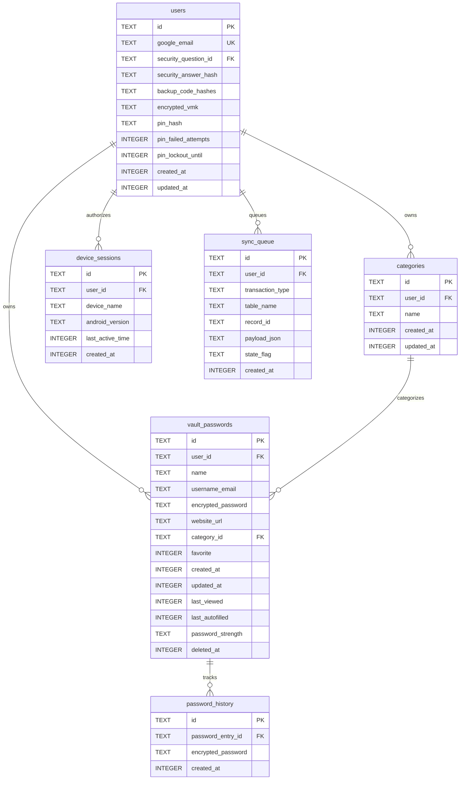

# SECUREVAULT - DATABASE SCHEMA DOCUMENT

---

## 1. Entity-Relationship Diagram (ERD)

This ERD models the local Room database schema (SQLite) and logical cloud representation:



---

## 2. Table Definitions

### 2.1 Users (`users`)
* **Purpose**: Stores account metadata, local unlock PIN configurations, security questions, and encrypted VMK payloads.
* **Columns**:
  | Column | Type | Nullable | Default | Constraints | Encrypted | Description |
  | :--- | :--- | :---: | :--- | :--- | :---: | :--- |
  | `id` | TEXT | NO | None | PRIMARY KEY | NO | Google user unique ID (`uid` from JWT). |
  | `google_email` | TEXT | NO | None | UNIQUE | NO | Authenticated Google email address. |
  | `security_question_id` | TEXT | NO | None | CHECK length > 0 | NO | ID referencing predefined security question. |
  | `security_answer_hash` | TEXT | NO | None | CHECK length = 64 | YES (Hash) | Salted SHA-256 hash of security answer. |
  | `backup_code_hashes` | TEXT | NO | None | CHECK length > 0 | YES (Hash) | Comma-separated list of SHA-256 backup code hashes. |
  | `encrypted_vmk` | TEXT | NO | None | CHECK length > 0 | YES (KMS) | Decryption key encrypted by cloud KMS provider. |
  | `pin_hash` | TEXT | NO | None | CHECK length = 64 | YES (Hash) | Salted SHA-256 hash of device-specific PIN. |
  | `pin_failed_attempts` | INTEGER | NO | 0 | CHECK >= 0 | NO | Consecutive failed PIN entry attempts. |
  | `pin_lockout_until` | INTEGER | YES | NULL | None | NO | Unix timestamp epoch (ms) indicating lockout limit. |
  | `created_at` | INTEGER | NO | (strftime('%s','now')*1000) | None | NO | Unix timestamp indicating user creation date. |
  | `updated_at` | INTEGER | NO | (strftime('%s','now')*1000) | None | NO | Unix timestamp indicating last update. |

* **Unique Constraints**: `google_email` must be unique to prevent duplicate cloud account provisioning.
* **Check Constraints**: `pin_failed_attempts >= 0` to prevent database corruption updates.
* **Indexes**: None. Reads are performed uniquely using the Primary Key (`id`).

---

### 2.2 Vault Passwords (`vault_passwords`)
* **Purpose**: Holds the core user-created password listings.
* **Columns**:
  | Column | Type | Nullable | Default | Constraints | Encrypted | Description |
  | :--- | :--- | :---: | :--- | :--- | :---: | :--- |
  | `id` | TEXT | NO | None | PRIMARY KEY | NO | Randomly generated UUID string. |
  | `user_id` | TEXT | NO | None | FOREIGN KEY | NO | User ID who owns this entry. |
  | `name` | TEXT | NO | None | CHECK length > 0 | NO | Display name of the account/website. |
  | `username_email` | TEXT | NO | None | CHECK length > 0 | NO | Registered account username/email. |
  | `encrypted_password` | TEXT | NO | None | CHECK length > 0 | YES (VMK) | AES-256-GCM ciphertext of the password. |
  | `website_url` | TEXT | YES | NULL | None | NO | Access URL link of the website. |
  | `category_id` | TEXT | YES | NULL | FOREIGN KEY | NO | Category ID grouping this entry. |
  | `favorite` | INTEGER | NO | 0 | CHECK (favorite IN (0, 1)) | NO | Boolean star toggle (1 = Starred, 0 = Normal). |
  | `created_at` | INTEGER | NO | (strftime('%s','now')*1000) | None | NO | Creation date timestamp. |
  | `updated_at` | INTEGER | NO | (strftime('%s','now')*1000) | None | NO | Modification date timestamp. |
  | `last_viewed` | INTEGER | YES | NULL | None | NO | Last view date timestamp. |
  | `last_autofilled` | INTEGER | YES | NULL | None | NO | Last Android Autofill date timestamp. |
  | `password_strength` | TEXT | NO | 'WEAK' | CHECK (password_strength IN ('WEAK','MEDIUM','STRONG')) | NO | Evaluation strength metrics. |
  | `deleted_at` | INTEGER | YES | NULL | None | NO | Soft-delete timestamp (Trash countdown). |

* **Foreign Keys**:
  * `user_id` REFERENCES `users(id)` ON DELETE CASCADE.
    * *Justification*: Purging a user must immediately cascade delete all their stored credentials.
  * `category_id` REFERENCES `categories(id)` ON DELETE SET NULL.
    * *Justification*: Deleting a category must not orphan/delete credentials; it resets the category to uncategorized.
* **Indexes**:
  * `idx_passwords_user_search`: `(user_id, name, username_email, website_url)` (B-Tree).
    * *Justification*: Optimizes real-time dashboard searches and client filtering.
  * `idx_passwords_deleted`: `(user_id, deleted_at)` (B-Tree).
    * *Justification*: Optimizes Trash screen query logic and automatic 30-day purge scans.

---

### 2.3 Password History (`password_history`)
* **Purpose**: Retains previously used passwords for historical recovery.
* **Columns**:
  | Column | Type | Nullable | Default | Constraints | Encrypted | Description |
  | :--- | :--- | :---: | :--- | :--- | :---: | :--- |
  | `id` | TEXT | NO | None | PRIMARY KEY | NO | Randomly generated UUID string. |
  | `password_entry_id` | TEXT | NO | None | FOREIGN KEY | NO | Link referencing the parent credentials ID. |
  | `encrypted_password` | TEXT | NO | None | CHECK length > 0 | YES (VMK) | AES-256-GCM ciphertext of the old password. |
  | `created_at` | INTEGER | NO | (strftime('%s','now')*1000) | None | NO | Modification date timestamp. |

* **Foreign Keys**:
  * `password_entry_id` REFERENCES `vault_passwords(id)` ON DELETE CASCADE.
    * *Justification*: Deleting a credential entry must cascade delete all associated old password history records.
* **Indexes**:
  * `idx_history_entry`: `(password_entry_id, created_at DESC)` (B-Tree).
    * *Justification*: Speeds up retrieval of the last 3 historical entries displayed on details screen.

---

### 2.4 Categories (`categories`)
* **Purpose**: Defines custom or predefined categories.
* **Columns**:
  | Column | Type | Nullable | Default | Constraints | Encrypted | Description |
  | :--- | :--- | :---: | :--- | :--- | :---: | :--- |
  | `id` | TEXT | NO | None | PRIMARY KEY | NO | Randomly generated UUID string. |
  | `user_id` | TEXT | NO | None | FOREIGN KEY | NO | User ID who owns this category. |
  | `name` | TEXT | NO | None | CHECK length > 0 | NO | Name of category (e.g. 'Personal'). |
  | `created_at` | INTEGER | NO | (strftime('%s','now')*1000) | None | NO | Creation date. |
  | `updated_at` | INTEGER | NO | (strftime('%s','now')*1000) | None | NO | Last modification date. |

* **Foreign Keys**:
  * `user_id` REFERENCES `users(id)` ON DELETE CASCADE.
    * *Justification*: Deleting a user must cascade delete all custom categories they created.
* **Indexes**:
  * `idx_categories_user`: `(user_id)` (B-Tree).
    * *Justification*: Accelerates category dropdown rendering in dashboard layout.

---

### 2.5 Device Sessions (`device_sessions`)
* **Purpose**: Tracks active concurrent login sessions per account.
* **Columns**:
  | Column | Type | Nullable | Default | Constraints | Encrypted | Description |
  | :--- | :--- | :---: | :--- | :--- | :---: | :--- |
  | `id` | TEXT | NO | None | PRIMARY KEY | NO | Session ID (derived from `ANDROID_ID`). |
  | `user_id` | TEXT | NO | None | FOREIGN KEY | NO | User ID associated with this session. |
  | `device_name` | TEXT | NO | None | CHECK length > 0 | NO | User-visible device model string (e.g., 'Pixel 7'). |
  | `android_version` | TEXT | NO | None | CHECK length > 0 | NO | Operating system version (e.g., '14.0'). |
  | `last_active_time` | INTEGER | NO | (strftime('%s','now')*1000) | None | NO | Timestamp of last API connection event. |
  | `created_at` | INTEGER | NO | (strftime('%s','now')*1000) | None | NO | Session creation date. |

* **Foreign Keys**:
  * `user_id` REFERENCES `users(id)` ON DELETE CASCADE.
    * *Justification*: Deleting a user account must terminate and remove all device sessions.
* **Indexes**:
  * `idx_sessions_user`: `(user_id)` (B-Tree).
    * *Justification*: Speeds up device sessions count evaluations to enforce the 3-device limit.

---

### 2.6 Sync Queue (`sync_queue`)
* **Purpose**: Handles offline-first transaction logging.
* **Columns**:
  | Column | Type | Nullable | Default | Constraints | Encrypted | Description |
  | :--- | :--- | :---: | :--- | :--- | :---: | :--- |
  | `id` | TEXT | NO | None | PRIMARY KEY | NO | Randomly generated UUID string. |
  | `user_id` | TEXT | NO | None | FOREIGN KEY | NO | User ID queue belongs to. |
  | `transaction_type` | TEXT | NO | None | CHECK (transaction_type IN ('INSERT','UPDATE','DELETE')) | NO | Database operation category. |
  | `table_name` | TEXT | NO | None | CHECK (table_name IN ('vault_passwords','categories')) | NO | Target collection name. |
  | `record_id` | TEXT | NO | None | CHECK length > 0 | NO | Target record primary key ID. |
  | `payload_json` | TEXT | YES | NULL | None | NO | JSON representation of the database record payload. |
  | `state_flag` | TEXT | NO | 'pending' | CHECK (state_flag IN ('pending','failed')) | NO | Queue processing status. |
  | `created_at` | INTEGER | NO | (strftime('%s','now')*1000) | None | NO | Queue entry insertion date. |

* **Foreign Keys**:
  * `user_id` REFERENCES `users(id)` ON DELETE CASCADE.
    * *Justification*: Deleting a user must wipe any pending synchronization queue items.
* **Indexes**:
  * `idx_sync_pending`: `(user_id, state_flag)` (B-Tree).
    * *Justification*: Optimizes background sync query lookups when WorkManager starts.

---

## 3. Soft Delete Policy

* **Soft-Deleted Table**: Only the `vault_passwords` table supports soft-deletion (using the `deleted_at` column).
  * *Justification*: Soft-deletion supports the F-VAULT-07 Trash system, allowing users to restore mistakenly deleted credentials within 30 days.
* **Hard-Deleted Tables**: All other tables (`device_sessions`, `sync_queue`, `categories`, `password_history`) use hard deletion (`DELETE` statements).
  * *Justification*: Removing a category, device session, old history entry, or completed sync item does not require retention, and hard deletion prevents database bloat.

---

## 4. Audit Trail

* **Audited Tables**: `users`, `vault_passwords`, and `categories` tables require tracking creation and modification dates.
* **Audit Columns**: `created_at` and `updated_at` are implemented as UNIX epoch timestamps (milliseconds) on the records.
* **Enforcement Layer**:
  * **Client App**: Room Database triggers `@Insert` and `@Update` callbacks on DAO layers to set `created_at` and `updated_at` automatically using the device time before executing SQLite writes.
  * **Backend Gateway**: Firebase Functions middleware updates the `updated_at` timestamp on server-side records using server-relative system time to prevent client clock skew issues during sync.
  * *Justification*: Trigger-based tracking inside SQLite/Room ensures audit columns are updated on local writes without requiring manual coding on every query.

---

## 5. Data Integrity Rules

The SQLite engine enforces several constraints to maintain database validity:
1. **6-Digit PIN Match**: `users(pin_hash)` check constraint restricts entry structures to exactly 64-character hex strings generated from 6-digit numeric inputs.
2. **Valid Category Binding**: `vault_passwords(category_id)` foreign key constraint rejects category assignment values that do not exist in the `categories` table.
3. **Invalid History Prevention**: `password_history(password_entry_id)` foreign key constraint blocks historical entries lacking a valid parent credential entry in the `vault_passwords` table.
4. **Favorite Binary Toggle**: `vault_passwords(favorite)` check constraint enforces binary values (0 or 1), preventing boolean representation anomalies.
5. **Sync Queue Type Constraint**: `sync_queue(transaction_type)` check constraint blocks undefined transactions, allowing only `INSERT`, `UPDATE`, or `DELETE` events.

---

## 6. Sensitive Data Map

Cross-referencing the classification definitions in the Security Requirements:

| Table | Column | Classification | Encryption Standard | Justification |
| :--- | :--- | :--- | :--- | :--- |
| `users` | `security_answer_hash` | **RESTRICTED** | SHA-256 Hashed | Plaintext answer must never reside on database. |
| `users` | `backup_code_hashes` | **RESTRICTED** | SHA-256 Hashed | Recovery codes must not be read in plaintext. |
| `users` | `encrypted_vmk` | **RESTRICTED** | AES-256-GCM (Cloud KMS) | Vault decryption key; backend must store encrypted. |
| `users` | `pin_hash` | **RESTRICTED** | SHA-256 Hashed | Device unlock credentials. |
| `vault_passwords` | `encrypted_password` | **RESTRICTED** | AES-256-GCM (VMK) | Plaintext credentials must never be in databases. |
| `password_history` | `encrypted_password` | **RESTRICTED** | AES-256-GCM (VMK) | History records must remain encrypted. |
| `categories` | `name` | **CONFIDENTIAL** | Table-Level SQLCipher | Category naming lists indicate user account contexts. |

---

## 7. Migration Strategy

### Naming Convention
* Migration scripts must follow the format `V[VERSION]__[Description].sql` (e.g., `V1__init_schema.sql`, `V2__add_trash_deleted_at.sql`).

### Execution Order & Automation
* **Android Client**: Room database migration configurations manage local upgrades. SQLite schemas are updated automatically using `Room.databaseBuilder().addMigrations(MIGRATION_1_2).build()`.
* **Backend Cloud Database**: Migration operations are run programmatically by cloud database deployment scripts before starting the updated Firebase Cloud Functions gateway.

### Rollback Procedure
* Destructive updates (such as table drops or column changes) must execute backing up database snapshots before execution.
* If a migration fails, the upgrade transaction aborts, the database state is restored from the snapshot, and the client/gateway executes a rollback to the previous version build.

---

## 8. Seed Data

To prepare a new database instance for deployment, the following seed data must be inserted:

### 1. Predefined Categories
Each new user account must receive 5 default categories populated in the `categories` table during account initialization:
```sql
INSERT INTO categories (id, user_id, name) VALUES ('cat_personal_id', :user_id, 'Personal');
INSERT INTO categories (id, user_id, name) VALUES ('cat_work_id', :user_id, 'Work');
INSERT INTO categories (id, user_id, name) VALUES ('cat_banking_id', :user_id, 'Banking');
INSERT INTO categories (id, user_id, name) VALUES ('cat_shopping_id', :user_id, 'Shopping');
INSERT INTO categories (id, user_id, name) VALUES ('cat_social_id', :user_id, 'Social');
```

### 2. Predefined Security Questions
Predefined questions are managed in backend system configurations:
1. *"What was your first school's name?"*
2. *"What was your childhood nickname?"*
3. *"What was your favorite teacher's name?"*
4. *"What city were you born in?"*
*(Up to 15 default question references).*
