# SECUREVAULT - ROUTES SPECIFICATION DOCUMENT

---

## 1. Route Registry

| Route ID | Name/Path | Screen ID | Auth Required | Role Guard | Navigator Type |
| :--- | :--- | :--- | :---: | :---: | :--- |
| **RT-ONB-01** | `onboarding/login` | `SCR-ONB-01` | None | None | Root Switch Navigator |
| **RT-ONB-02** | `onboarding/security-question` | `SCR-ONB-02` | None | None | Onboarding Stack |
| **RT-ONB-03** | `onboarding/pin-create` | `SCR-ONB-03` | None | None | Onboarding Stack |
| **RT-ONB-04** | `onboarding/backup-codes` | `SCR-ONB-04` | None | None | Onboarding Stack |
| **RT-ATH-01** | `auth/challenge-question` | `SCR-ATH-01` | JWT | All | Auth Stack |
| **RT-ATH-02** | `auth/unlock-pin` | `SCR-ATH-02` | JWT | All | Auth Stack |
| **RT-ATH-03** | `auth/lockout` | `SCR-ATH-03` | JWT | All | Auth Stack |
| **RT-ATH-05** | `auth/environment-warning` | `SCR-ATH-05` | JWT | Developers | Auth Stack |
| **RT-VLT-01** | `vault/dashboard` | `SCR-VLT-01` | JWT | All | Tab Navigator (Tab 1) |
| **RT-VLT-02** | `vault/add` | `SCR-VLT-02` | JWT | All | Dashboard Stack |
| **RT-VLT-03** | `vault/edit/{id}` | `SCR-VLT-02` | JWT | All | Dashboard Stack |
| **RT-VLT-04** | `vault/details/{id}` | `SCR-VLT-03` | JWT | All | Dashboard Stack |
| **RT-VLT-05** | `vault/categories` | `SCR-VLT-04` | JWT | All | Tab Navigator (Tab 2) |
| **RT-GEN-01** | `generator` | `SCR-GEN-01` | JWT | All | Tab Navigator (Tab 3) |
| **RT-GEN-02** | `generator/health` | `SCR-GEN-02` | JWT | All | Dashboard Stack |
| **RT-SET-01** | `settings` | `SCR-SET-01` | JWT | All | Tab Navigator (Tab 4) |
| **RT-SET-02** | `settings/security` | `SCR-SET-02` | JWT | All | Settings Stack |
| **RT-SET-03** | `settings/trash` | `SCR-SET-03` | JWT | All | Settings Stack |
| **RT-DEV-01** | `settings/devices` | `SCR-DEV-01` | JWT | All | Settings Stack |

---

## 2. Navigator Tree

This hierarchy maps the navigation flow of the Android client application:

```mermaid
graph TD
    Root[Root Switch Navigator] -->|Unauthenticated| OnbStack[Onboarding Stack Navigator]
    Root -->|Authenticated| AuthStack[Auth Stack Navigator]
    Root -->|Unlocked VMK| AppMain[App Tab Navigator]

    subgraph Onboarding Stack Navigator
        OnbStack --> RT-ONB-01[RT-ONB-01: onboarding/login]
        OnbStack --> RT-ONB-02[RT-ONB-02: onboarding/security-question]
        OnbStack --> RT-ONB-03[RT-ONB-03: onboarding/pin-create]
        OnbStack --> RT-ONB-04[RT-ONB-04: onboarding/backup-codes]
    end

    subgraph Auth Stack Navigator
        AuthStack --> RT-ATH-05[RT-ATH-05: auth/environment-warning]
        AuthStack --> RT-ATH-01[RT-ATH-01: auth/challenge-question]
        AuthStack --> RT-ATH-02[RT-ATH-02: auth/unlock-pin]
        AuthStack --> RT-ATH-03[RT-ATH-03: auth/lockout]
    end

    subgraph App Tab Navigator
        AppMain --> Tab1[Tab 1: Dashboard Stack]
        AppMain --> Tab2[Tab 2: Categories Stack]
        AppMain --> Tab3[Tab 3: Generator Stack]
        AppMain --> Tab4[Tab 4: Settings Stack]
    end

    subgraph Tab 1: Dashboard Stack
        Tab1 --> RT-VLT-01[RT-VLT-01: vault/dashboard]
        Tab1 --> RT-VLT-02[RT-VLT-02: vault/add]
        Tab1 --> RT-VLT-03[RT-VLT-03: vault/edit/:id]
        Tab1 --> RT-VLT-04[RT-VLT-04: vault/details/:id]
        Tab1 --> RT-GEN-02[RT-GEN-02: generator/health]
    end

    subgraph Tab 2: Categories Stack
        Tab2 --> RT-VLT-05[RT-VLT-05: vault/categories]
    end

    subgraph Tab 3: Generator Stack
        Tab3 --> RT-GEN-01[RT-GEN-01: generator]
    end

    subgraph Tab 4: Settings Stack
        Tab4 --> RT-SET-01[RT-SET-01: settings]
        Tab4 --> RT-SET-02[RT-SET-02: settings/security]
        Tab4 --> RT-SET-03[RT-SET-03: settings/trash]
        Tab4 --> RT-DEV-01[RT-DEV-01: settings/devices]
    end
```

---

## 3. Auth Routing Logic

### Unauthenticated Routing
* **Action**: If a user attempts to open any route without a valid Firebase ID Token (JWT), the Root Navigator must intercept the request, clear the navigation back stack, and redirect the user immediately to `onboarding/login` (`RT-ONB-01`).

### Post-Login Role Routing
Upon a successful Google Sign-in token return, the client checks the user role state and routes to the appropriate entry screen:

* **General Users & Students**: Route to standard PIN Unlock `auth/unlock-pin` (`RT-ATH-02`).
* **Professionals**: Route to Enterprise PIN Unlock `auth/unlock-pin` (`RT-ATH-02` with professional view variant).
* **Developers**: Route to Environment Warning `auth/environment-warning` (`RT-ATH-05`) if local root/debugging is active; otherwise route to standard `auth/unlock-pin`.

### Token Expiry Mid-Session
* **Behavior**: If the Firebase ID Token expires during a session and cannot be refreshed (e.g., refresh token revoked on backend), the app must immediately trigger a session termination.
* **State Preservation**: The current route path is cleared from memory. The app must block the user interface, purge decrypted VMK caches from memory, wipe clipboards, and route directly to the Google Sign-in screen (`RT-ONB-01`).

---

## 4. Deep Links

### Deep-Link Configurations
* **Universal Link Scheme**: `securevault://`
* **Domain Link**: `https://app.securevault.com/`

| Route ID | Path | Deep-Linkable | Action |
| :--- | :--- | :---: | :--- |
| **RT-ONB-01** | `onboarding/login` | **No** | None |
| **RT-VLT-01** | `vault/dashboard` | **Yes** | Opens standard Dashboard. |
| **RT-VLT-04** | `vault/details/{id}` | **Yes** | Opens Details screen for target ID (e.g., `securevault://vault/details/uuid`). |
| **RT-GEN-02** | `generator/health` | **Yes** | Opens Health Dashboard. |
| **RT-SET-03** | `settings/trash` | **Yes** | Opens Trash folder. |

### Auth Gate Deep Link Behavior
1. The user clicks a deep link (e.g., `securevault://vault/details/uuid`) when unauthenticated.
2. The Root Navigator intercepts the link, extracts the target destination path, and caches it in volatile memory.
3. The app routes the user to `onboarding/login` (`RT-ONB-01`).
4. Once Google Sign-in and PIN unlock complete, the app reads the cached destination path and routes the user directly to the deep-linked screen, clearing the cache.

---

## 5. Route Guards

The client app enforces three distinct route guards during navigation transitions:

### 1. Google Authentication Guard
* **Associated Routes**: All routes except `onboarding/` paths.
* **Condition**: Active Firebase JWT ID token must exist.
* **Failure Behavior**: Immediately redirect to `onboarding/login` (`RT-ONB-01`).

### 2. PIN Unlock Guard
* **Associated Routes**: All `vault/` and `settings/` paths.
* **Condition**: The VMK must be decrypted and loaded in volatile memory (cached in Android Keystore).
* **Failure Behavior**: Redirect to `auth/unlock-pin` (`RT-ATH-02`).

### 3. Verification Token Guard
* **Associated Routes**: `settings/trash` (when executing permanent deletes), `settings/devices` (when revoking sessions), and CSV/PDF exports.
* **Condition**: A valid, short-lived challenge token returned from a verified Security Question verification must be present.
* **Failure Behavior**: Halt routing transition and display a modal Security Question Challenge overlay.

---

## 6. Back Navigation Rules

### Back Stack Clears
The back navigation stack must be cleared (`FLAG_ACTIVITY_NEW_TASK | FLAG_ACTIVITY_CLEAR_TASK`) during the following transitions to prevent users from returning to secure/setup screens using the hardware back button:
1. **Onboarding Completed**: Transitioning from `onboarding/backup-codes` (`RT-ONB-04`) to `vault/dashboard` (`RT-VLT-01`).
2. **Account Logout**: Transitioning from Settings (`RT-SET-01`) to Onboarding Login (`RT-ONB-01`).
3. **Account Locked**: Transitioning from PIN Unlock (`RT-ATH-02`) to Lockout Screen (`RT-ATH-03`).

### Back Interceptions
Hardware back buttons are intercepted and blocked on the following screens:
* **Add/Edit Password (`RT-VLT-02`)**: Intercepted to check if input fields have changed. If edited, displays confirmation dialog: *"Discard changes? Unsaved edits will be lost."*
* **Lockout Screen (`RT-ATH-03`)**: Intercepted and disabled completely. User cannot exit the lockout cooldown screen via back navigation keys.
* **Google Sign-In (`RT-ONB-01`)**: Intercepted to exit the application completely.
* **PIN Lock Screen (`RT-ATH-02`)**: Intercepted to exit the application completely.
