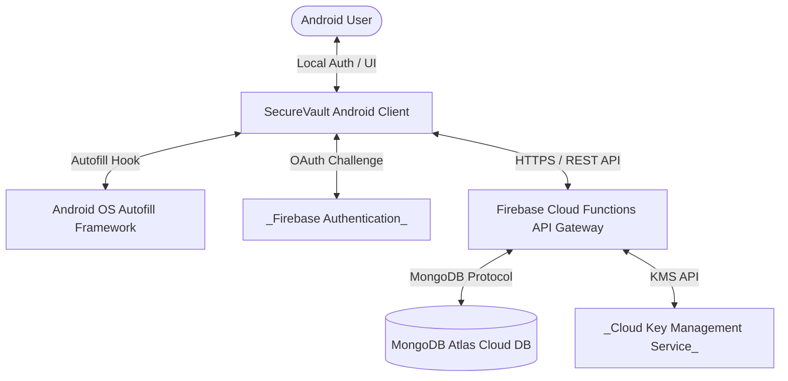

# SECUREVAULT - SOFTWARE REQUIREMENTS SPECIFICATION (SRS)

---

## 1. Introduction

### 1.1 Purpose and Scope
This document specifies the complete software requirements for the SecureVault password manager (version 1.0). SecureVault is an Android native mobile application that provides secure, local, and cloud-synchronized password vault capabilities. This specification covers the functional interfaces, data schema controls, API gateway requirements, synchronization engine, and security mechanisms enforced to protect user credentials.

### 1.2 Definitions and Abbreviations
* **ART**: Android Runtime
* **KMS**: Key Management Service (Google Cloud KMS / AWS KMS)
* **MFA**: Multi-Factor Authentication
* **MitM**: Man-in-the-Middle (network eavesdropping)
* **MoSCoW**: Must, Should, Could, Won't priority classification
* **NFR**: Non-Functional Requirement
* **PII**: Personally Identifiable Information
* **PRD**: Product Requirements Document
* **Room**: Google Jetpack local SQLite object-relational mapping library
* **SQLCipher**: Open-source extension that provides transparent 256-bit AES encryption for SQLite database files
* **VMK**: Vault Master Key (AES-256 key used to encrypt the user's passwords)

### 1.3 Intended Audience
This document is intended for:
1. Android Developers implementing the client application.
2. Backend Engineers developing Firebase Functions and MongoDB Atlas integrations.
3. Quality Assurance (QA) Engineers writing automated test scripts.
4. Security Auditors validating cryptographic boundaries.

### 1.4 Document Metadata
* **Version**: 0.1
* **Date**: June 13, 2026

---

## 2. System Description

### 2.1 System Context
SecureVault interfaces with the following entities:
* **Android User**: Accesses the vault via PIN, Biometrics, or Google Sign-In.
* **Android OS (Autofill Framework)**: Prompts SecureVault to autofill focused input controls in third-party applications.
* **Firebase Auth (Google Sign-in)**: External identity provider validating Google account credentials.
* **API Gateway (Firebase Cloud Functions)**: Gateway verifying client requests and syncing vault entries.
* **MongoDB Atlas Database**: Centralized persistent cloud storage.

### 2.2 Context Diagram

### 2.3 Environmental Assumptions
1. **Trusted Execution Environment (TEE)**: The host device possesses a hardware-backed security enclave (StrongBox or Keymaster) supporting the Android Keystore API.
2. **Network Integrity**: Secure connection capabilities (HTTPS/TLS) are available on the client device.
3. **OS Integrity**: The host operating system's security boundaries have not been completely bypassed (warnings are shown if root is detected).

---

## 3. Functional Requirements

### Module: Authentication & Onboarding (AUTH)

#### FR-AUTH-01: Google Sign-In Session Creation
* **Requirement**: The system SHALL verify the Google OAuth token received from the Android Credential Manager API via Firebase Authentication and, upon validation, retrieve the user's encrypted VMK from the API gateway over a secure TLS connection.
* **Rationale**: Leverages Google's authentication infrastructure to authenticate users without storing plaintext passwords.
* **Source**: F-AUTH-01
* **Verification Method**: Demonstration
* **Priority**: Must

#### FR-AUTH-02: Security Question Registration and Validation
* **Requirement**: The system SHALL require the user to answer a registered security question prior to authorizing: new device logins, re-authentication after logout, switching accounts, password exports, PIN changes, security question changes, or backup code regeneration.
* **Rationale**: Adds a client-verifiable authentication factor to prevent unauthorized VMK retrieval.
* **Source**: F-AUTH-02
* **Verification Method**: Test
* **Priority**: Must

#### FR-AUTH-03: Local PIN Registration and Validation
* **Requirement**: The system SHALL prompt the user to register a device-specific 6-digit numeric PIN on onboarding and verify this PIN locally against the SQLCipher key hash before granting access to the dashboard.
* **Rationale**: Secures local storage and locks daily access behind a fast pin code.
* **Source**: F-AUTH-03
* **Verification Method**: Test
* **Priority**: Must

#### FR-AUTH-04: PIN Verification Rate Limiting & Lockout
* **Requirement**: The system SHALL disable the PIN entry pad for 30s after the 6th failed attempt, 1m after the 7th, 2m after the 8th, 5m after the 9th, 15m after the 10th, and SHALL lock the account for 2 hours after the 11th consecutive failed attempt, synchronizing this lockout state to the server database.
* **Rationale**: Defends against local dictionary and brute-force PIN attacks.
* **Source**: F-AUTH-04
* **Verification Method**: Test
* **Priority**: Must

#### FR-AUTH-05: Backup Code Access Restoration
* **Requirement**: The system SHALL allow the user to bypass the PIN entry screen and reset their PIN if they input a valid, single-use, alphanumeric backup code from the two generated during onboarding.
* **Rationale**: Provides a secure recovery path for users who forget their PIN.
* **Source**: F-AUTH-05
* **Verification Method**: Test
* **Priority**: Should

#### FR-AUTH-06: Local Biometric Authentication Bypass
* **Requirement**: The system SHALL display the Android system biometric prompt to unlock the app if enabled in settings, and SHALL immediately invalidate this biometric key if the Android OS registers a new fingerprint or face profile.
* **Rationale**: Allows convenient biometric unlock while protecting against unauthorized access if a new fingerprint is registered on the device.
* **Source**: F-AUTH-06
* **Verification Method**: Demonstration
* **Priority**: Should

---

### Module: Password Vault (VAULT)

#### FR-VAULT-01: Main Dashboard List Rendering
* **Requirement**: The system SHALL render a list of all active passwords on the dashboard, displaying the Website Favicon (fetched via backend proxy), website name, username/email, and a star indicator if flagged as a favorite.
* **Rationale**: Provides users with a clear, readable directory of their saved credentials.
* **Source**: F-VAULT-01
* **Verification Method**: Inspection
* **Priority**: Must

#### FR-VAULT-02: Password Entry Encryption and Decryption (CRUD)
* **Requirement**: The system SHALL encrypt the password field of an entry in-memory using AES-256-GCM via the VMK before writing it to the local SQLite/Room database, and SHALL decrypt the field only in-memory when requested on the details screen.
* **Rationale**: Keeps passwords encrypted at rest locally and in transit to the cloud.
* **Source**: F-VAULT-02
* **Verification Method**: Analysis
* **Priority**: Must

#### FR-VAULT-03: Password History Retention
* **Requirement**: The system SHALL append the previous password value to an encrypted collection of the last 3 prior passwords when the user updates a password entry.
* **Rationale**: Enables users to recover old passwords if they modified a credential by mistake.
* **Source**: F-VAULT-03
* **Verification Method**: Test
* **Priority**: Should

#### FR-VAULT-04: Clipboard Copy and Security Clear
* **Requirement**: The system SHALL copy the decrypted password value to the Android system clipboard upon user command, and SHALL erase the clipboard contents exactly 30 seconds after the copy command was executed.
* **Rationale**: Facilitates login copy-pasting while preventing background applications from sniffing the clipboard cache indefinitely.
* **Source**: F-VAULT-04
* **Verification Method**: Test
* **Priority**: Must

#### FR-VAULT-05: Favorites Star Sorting
* **Requirement**: The system SHALL prioritize entries flagged as favorites and sort them to the top of the dashboard password list.
* **Rationale**: Simplifies access to high-frequency credentials.
* **Source**: F-VAULT-05
* **Verification Method**: Demonstration
* **Priority**: Should

#### FR-VAULT-06: Category Organization
* **Requirement**: The system SHALL group credentials by categories (Personal, Work, Banking, Shopping, Social) and allow users to create, modify, and assign credentials to custom categories.
* **Rationale**: Helps users logically separate different kinds of online identities.
* **Source**: F-VAULT-06
* **Verification Method**: Demonstration
* **Priority**: Should

#### FR-VAULT-07: Trash Soft-Deletion Management
* **Requirement**: The system SHALL mark deleted passwords with a `deletedDate` timestamp and move them to a Trash folder for 30 days before permanently purging them from local and remote databases.
* **Rationale**: Prevents accidental deletions while ensuring automatic cleanup of older items.
* **Source**: F-VAULT-07
* **Verification Method**: Test
* **Priority**: Should

---

### Module: Password Generator (GEN)

#### FR-GEN-01: Password Complexity Generation
* **Requirement**: The system SHALL generate an alphanumeric password based on user constraints (length slider 8-64, uppercase, lowercase, numbers, symbols, and exclusion of similar characters like `i, l, 1, o, 0`).
* **Rationale**: Helps users create high-entropy, strong passwords easily.
* **Source**: F-GEN-01
* **Verification Method**: Demonstration
* **Priority**: Must

#### FR-GEN-02: Password Health Reporting
* **Requirement**: The system SHALL evaluate the vault contents and display counts for weak, medium, strong, and reused passwords on the Health Dashboard.
* **Rationale**: Informs users about vulnerabilities in their vault.
* **Source**: F-GEN-02
* **Verification Method**: Analysis
* **Priority**: Should

#### FR-GEN-03: Real-Time Password Reuse Warnings
* **Requirement**: The system SHALL alert the user with a warning dialog if they attempt to save a password that matches another active entry in the local vault.
* **Rationale**: Discourages password reuse across multiple services.
* **Source**: F-GEN-03
* **Verification Method**: Test
* **Priority**: Should

---

### Module: Search System (SRCH)

#### FR-SRCH-01: Real-Time Search Filtering
* **Requirement**: The system SHALL filter the password list on the dashboard in real-time as the user enters characters in the search bar, matching against name, email/username, and URL fields.
* **Rationale**: Allows users to quickly locate credentials.
* **Source**: F-SRCH-01
* **Verification Method**: Test
* **Priority**: Must

---

### Module: Autofill System (AUTO)

#### FR-AUTO-01: Android Autofill Service credential feeding
* **Requirement**: The system SHALL hook into the Android system `AutofillService` and feed matching username and password suggestions to input controls in native apps and standard WebView layouts.
* **Rationale**: Speeds up logging in by avoiding manual copying and pasting.
* **Source**: F-AUTO-01
* **Verification Method**: Demonstration
* **Priority**: Must

---

### Module: Data Export (EXP)

#### FR-EXP-01: Password Protected PDF Export
* **Requirement**: The system SHALL generate a password-encrypted PDF containing the user's credentials using the native Android `PdfDocument` API after a successful security question verification.
* **Rationale**: Provides a printable physical backup of vault contents protected by a user-configured password.
* **Source**: F-EXP-01
* **Verification Method**: Test
* **Priority**: Should

#### FR-EXP-02: Plaintext CSV Export
* **Requirement**: The system SHALL export all credentials to a plaintext CSV file and launch the share sheet after the user passes the security question challenge and approves a full-screen plaintext exposure warning.
* **Rationale**: Permits data portability and migration.
* **Source**: F-EXP-02
* **Verification Method**: Test
* **Priority**: Should

---

### Module: Synchronization & Offline Support (SYNC)

#### FR-SYNC-01: Local room encrypted database caching
* **Requirement**: The system SHALL write all offline actions to a local Room SQLite database encrypted with SQLCipher, appending the write commands to a local `Sync Queue` table marked as pending.
* **Rationale**: Assures data availability and creation capabilities when offline.
* **Source**: F-SYNC-01
* **Verification Method**: Analysis
* **Priority**: Must

#### FR-SYNC-02: Background Sync Work Execution
* **Requirement**: The system SHALL execute a background sync worker via Android `WorkManager` when network connectivity returns to push the local Sync Queue via REST endpoints and retrieve remote updates.
* **Rationale**: Keeps client and cloud databases synchronized automatically.
* **Source**: F-SYNC-02
* **Verification Method**: Test
* **Priority**: Must

#### FR-SYNC-03: Version / Timestamp Conflict Resolution
* **Requirement**: The system SHALL compare version counters on server updates and, if versions mismatch, accept the update with the later `updatedDate` timestamp.
* **Rationale**: Resolves data collisions between multiple syncing devices.
* **Source**: F-SYNC-03
* **Verification Method**: Test
* **Priority**: Must

---

### Module: Device Management & Security Protection (DEV)

#### FR-DEV-01: Device Limit Enforcement
* **Requirement**: The system SHALL limit active sessions to 3 devices per user account and, if a 4th login is attempted, block authentication and display the Active Devices screen to permit removal of an existing session.
* **Rationale**: Restricts access to a manageable number of authorized devices.
* **Source**: F-DEV-01
* **Verification Method**: Test
* **Priority**: Must

#### FR-DEV-02: Host Environment Inspection
* **Requirement**: The system SHALL scan the device on launch for root access binaries and developer USB debugging settings, displaying warning prompts if either condition is found.
* **Rationale**: Informs users of potential host compromises.
* **Source**: F-DEV-02
* **Verification Method**: Demonstration
* **Priority**: Should

---

## 4. Non-Functional Requirements

### 4.1 Security (SEC)

#### NFR-SEC-01: Database Encryption Standard
* **Requirement**: The system SHALL encrypt the local SQLite database file using SQLCipher in 256-bit AES-CBC mode.
* **Rationale**: Protects local database cache files from inspection if the device is stolen.
* **Source**: [Security Requirements Section 4]
* **Verification Method**: Analysis
* **Priority**: Must

#### NFR-SEC-02: Screenshot & Casting Block
* **Requirement**: The system SHALL set the flag `FLAG_SECURE` application-wide on all activities to block screenshots, recordings, and casting.
* **Rationale**: Defends against credential leaks from video recordings or screen capture overlays.
* **Source**: [Security Requirements Section 1]
* **Verification Method**: Demonstration
* **Priority**: Must

#### NFR-SEC-03: Session Background Timeout Locking
* **Requirement**: The system SHALL lock the application UI and require PIN or Biometric re-authentication if the application remains in the background for more than 5 minutes.
* **Rationale**: Prevents session hijacking if an unlocked phone is left unattended.
* **Source**: [Security Requirements Section 2]
* **Verification Method**: Test
* **Priority**: Must

---

### 4.2 Performance (PERF)

#### NFR-PERF-01: App Launch Time SLA
* **Requirement**: The system SHALL render the PIN entry screen or biometric prompt within < 2.0 seconds of app start.
* **Rationale**: Maintains a fast, responsive user experience.
* **Source**: [Technical Requirements Section 6]
* **Verification Method**: Test
* **Priority**: Must

#### NFR-PERF-02: UI List Filtering SLA
* **Requirement**: The system SHALL execute local search filtering queries and refresh the dashboard list in < 100ms.
* **Rationale**: Insures smooth real-time search typing.
* **Source**: [Technical Requirements Section 6]
* **Verification Method**: Test
* **Priority**: Must

#### NFR-PERF-03: Decryption SLA
* **Requirement**: The system SHALL complete in-memory AES-GCM-256 decryption of credentials in < 100ms.
* **Rationale**: Prevents interface delays when copying or revealing credentials.
* **Source**: [Technical Requirements Section 6]
* **Verification Method**: Test
* **Priority**: Must

#### NFR-PERF-04: Sync Reconcile SLA
* **Requirement**: The system SHALL process pending local Sync Queue changes to MongoDB Atlas and clear matching queue entries in < 5.0 seconds of network connectivity restoration.
* **Rationale**: Assures data consistency is updated quickly across devices.
* **Source**: [Technical Requirements Section 6]
* **Verification Method**: Test
* **Priority**: Must

---

## 5. External Interface Requirements

### 5.1 User Interfaces
* **Splash/Onboarding UI**: Renders setup guides, Google Sign-in action buttons, and triggers the account selection API.
* **Authentication Lock Screen**: Displays a 6-digit numeric PIN entry pad or prompts with a Biometric verification prompt.
* **Main Dashboard Screen**: Displays a search bar, categories/settings tab buttons, password list cards, and a FAB to create passwords.
* **Password Details Screen**: Displays decrypted field items and copy-to-clipboard icons. Contains edit/delete action triggers.
* **Active Devices Screen**: Lists current sessions and provides session revocation buttons.
* **Trash Screen**: Lists soft-deleted credentials with days remaining, providing restore and delete permanently actions.

### 5.2 Hardware Interfaces
* **Biometric Hardware**: The app interfaces with the device's fingerprint sensor or face unlock hardware via the standard Android `BiometricPrompt` framework.

### 5.3 Software Interfaces
* **Room Database**: Bridges Java/Kotlin data objects to local SQLite tables.
* **SQLCipher**: Intercepts Room database connections and performs transparent file encryption.
* **Android Keystore**: Generates and holds the AES key used to encrypt the SQLCipher database password.
* **Android Autofill Framework**: Communicates credential suggestions to system autofill managers.
* **Android Credential Manager API**: Handles Google accounts lookup and token returns.

### 5.4 Communication Interfaces
* **Network Protocol**: HTTPS over TLS 1.3.
* **API Endpoints**: REST-based endpoints exposed by Firebase Cloud Functions.
* **Data Format**: Payload requests and responses formatted in `application/json`.
* **Port**: TCP Port 443.

---

## 6. Constraints

### 6.1 Regulatory
* **Data Encryption Compliance**: The app's encryption (AES-256) must comply with local export regulations for cryptotools.
* **GDPR/CCPA Compliance**: When a user selects "Delete Account", all local and cloud data must be permanently purged within 72 hours, with no backups retained.

### 6.2 Hardware
* **Security Hardware**: Devices lacking hardware-backed keystores (Keymaster/StrongBox) are restricted from running biometrics and will store keys in software-backed emulations.
* **API Minimum**: The device must run Android 8.0 (API Level 26) or later.

### 6.3 Technology
* The codebase must compile using Kotlin 1.9.x, targeting Android SDK 34, utilizing the Room database engine. No third-party network database sync libraries can be imported (must sync via REST/WorkManager as specified in `Technical_Requirements.md`).

---

## 7. Traceability Matrix

| Business Need (Blueprint) | PRD Feature | SRS Requirement(s) | Verification Method |
| :--- | :--- | :--- | :--- |
| **Secure password storage** | `F-VAULT-02` | `FR-VAULT-02`, `NFR-SEC-01` | Test / Analysis |
| **Cloud synchronization** | `F-SYNC-02` | `FR-SYNC-02`, `NFR-PERF-04` | Test |
| **Fast password retrieval** | `F-SRCH-01` | `FR-SRCH-01`, `NFR-PERF-02` | Test |
| **Password generation** | `F-GEN-01` | `FR-GEN-01` | Demonstration |
| **Password health analysis** | `F-GEN-02` | `FR-GEN-02` | Analysis |
| **Android Autofill integration** | `F-AUTO-01` | `FR-AUTO-01` | Demonstration |
| **Multi-device support** | `F-DEV-01` | `FR-DEV-01` | Test |
| **Export functionality** | `F-EXP-01` | `FR-EXP-01` | Test |
| **Zero-Knowledge VMK storage** | `F-AUTH-01` | `FR-AUTH-01` | Analysis |
| **PIN Lockout System** | F-AUTH-04 | `FR-AUTH-04` | Test |
| **Device session cleanup** | `F-DEV-01` | `FR-DEV-01` | Test |
| **Clipboard Security** | `F-VAULT-04` | `FR-VAULT-04` | Test |
| **Root Warning Alert** | `F-DEV-02` | `FR-DEV-02` | Demonstration |
| **Trash Recover System** | `F-VAULT-07` | `FR-VAULT-07` | Test |
