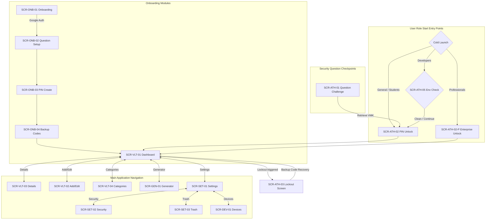

# SECUREVAULT - SCREENS SPECIFICATION DOCUMENT

---

## 1. Onboarding Screen Module (ONB)

### **SCR-ONB-01 — Onboarding & Google Sign-In Screen**
* **Role**: All Users (initial setup entry point)
* **Purpose**: Displays the product value slides and initiates the user authentication.
* **Route reference**: `onboarding/login`
* **Entry points**: App cold launch (first-time run).
* **Content inventory**:
  | Element | Data source | API endpoint | Notes |
  | :--- | :--- | :--- | :--- |
  | Welcome Slides Carousel | Local static resources | None | Slide pagination indicator. |
  | Google Sign-In Button | Local platform call | `/v1/auth/login` | Launches Credential Manager overlay. |
* **Available actions**:
  | Action | Trigger | Result | API call |
  | :--- | :--- | :--- | :--- |
  | Authenticate | Tap Google Sign-In | If registered, goes to `SCR-ATH-02` (PIN Unlock). If new, goes to `SCR-ONB-02` (Question Setup). | `/v1/auth/login` |
* **State variations**:
  * **Loading**: Disables buttons; displays a modal loading spinner.
  * **Empty**: Not applicable.
  * **Error**: Displays "Sign-In Failed. Please check internet connection." Toast notification with re-try enablement.
  * **Role variant**: None.
* **Exit points**: `SCR-ONB-02` (Setup Security Question), `SCR-ATH-02` (PIN Unlock).

---

### **SCR-ONB-02 — Security Question Setup Screen**
* **Role**: All Users
* **Purpose**: Prompts new users to select a security question and submit an answer.
* **Route reference**: `onboarding/security-question`
* **Entry points**: Successful Google Sign-in on a new account (`SCR-ONB-01`).
* **Content inventory**:
  | Element | Data source | API endpoint | Notes |
  | :--- | :--- | :--- | :--- |
  | Question Dropdown list | Predefined static array | None | List of 15 predefined questions. |
  | Answer input field | User text | None | Alphanumeric plaintext input. |
* **Available actions**:
  | Action | Trigger | Result | API call |
  | :--- | :--- | :--- | :--- |
  | Save Setup | Tap Continue | Hashes answer, generates VMK, and navigates to `SCR-ONB-03` (PIN Create). | `/v1/auth/security-question/setup` |
* **State variations**:
  * **Loading**: Input field disabled; progress indicator active.
  * **Empty**: Text field empty. Displays hint: "Answer cannot be blank".
  * **Error**: Displays "Connection timed out. Please try again." dialog with a "Retry" button.
  * **Role variant**: None.
* **Exit points**: `SCR-ONB-03` (PIN Creation).

---

### **SCR-ONB-03 — PIN Creation Screen**
* **Role**: All Users
* **Purpose**: Enables users to set up a 6-digit numeric unlock PIN.
* **Route reference**: `onboarding/pin-create`
* **Entry points**: Completed security question setup (`SCR-ONB-02`).
* **Content inventory**:
  | Element | Data source | API endpoint | Notes |
  | :--- | :--- | :--- | :--- |
  | Numeric Keypad | UI View | None | 0-9 keys, delete, clear. |
  | PIN Dot Indicators | UI View | None | 6 indicator dots indicating input count. |
* **Available actions**:
  | Action | Trigger | Result | API call |
  | :--- | :--- | :--- | :--- |
  | Enter PIN | Tap 6 numeric values | Validates match; caches key in Keystore and goes to `SCR-ONB-04` (Backup Codes). | None (Client-side SQLCipher init) |
* **State variations**:
  * **Loading**: Keys disabled.
  * **Empty**: Blank dots.
  * **Error**: Mismatch on confirmation prompt. Displays "PINs do not match. Please re-enter." and clears input.
  * **Role variant**: None.
* **Exit points**: `SCR-ONB-04` (Backup Codes).

---

### **SCR-ONB-04 — Backup Code Generation Screen**
* **Role**: All Users
* **Purpose**: Displays generated recovery backup codes and forces user confirmation.
* **Route reference**: `onboarding/backup-codes`
* **Entry points**: Completed PIN creation (`SCR-ONB-03`).
* **Content inventory**:
  | Element | Data source | API endpoint | Notes |
  | :--- | :--- | :--- | :--- |
  | Backup codes display | Local generation | `/v1/auth/backup-codes/regenerate` | Two alphanumeric codes (e.g. `AB7K-XP92`). |
  | Copy Codes Button | UI Clipboard | None | Copies codes to clipboard. |
* **Available actions**:
  | Action | Trigger | Result | API call |
  | :--- | :--- | :--- | :--- |
  | Acknowledge Codes | Tap "I have written these down" | Navigates to `SCR-VLT-01` (Dashboard). | None |
* **State variations**:
  * **Loading**: Spinner while server writes backup code hashes.
  * **Empty**: None.
  * **Error**: Server sync error. Displays "Failed to write backup codes. Retrying..." and automatically retries.
  * **Role variant**: None.
* **Exit points**: `SCR-VLT-01` (Dashboard).

---

## 2. Authentication Screen Module (ATH)

### **SCR-ATH-01 — Security Question Challenge Screen**
* **Role**: All Users (New device login / Re-authentication path)
* **Purpose**: Challenges users with their security question to retrieve the VMK.
* **Route reference**: `auth/challenge-question`
* **Entry points**: App launch on a secondary device or re-authentication after logout.
* **Content inventory**:
  | Element | Data source | API endpoint | Notes |
  | :--- | :--- | :--- | :--- |
  | Security Question text | `/v1/auth/login` payload | None | Displays the user's specific question. |
  | Answer input field | User text | `/v1/auth/vmk` | Text field with lowercase normalisation. |
* **Available actions**:
  | Action | Trigger | Result | API call |
  | :--- | :--- | :--- | :--- |
  | Submit Answer | Tap Verify button | Unlocks VMK, decrypts cache, and navigates to `SCR-ATH-02` (PIN Unlock). | `/v1/auth/vmk` |
* **State variations**:
  * **Loading**: Text fields disabled; loader active.
  * **Empty**: Displays error "Answer field is empty" on submit.
  * **Error**: Mismatch answer. Displays warning toast: "Incorrect answer. [N] attempts remaining."
  * **Role variant**: None.
* **Exit points**: `SCR-ATH-02` (PIN Unlock).

---

### **SCR-ATH-02 — PIN Unlock Screen**
* **Role**: Students, Developers, General Users (Standard Start Screen)
* **Purpose**: Device-specific lock screen to authorize local database decryption.
* **Route reference**: `auth/unlock-pin`
* **Entry points**: Daily app launch, background app resume, or manual locking.
* **Content inventory**:
  | Element | Data source | API endpoint | Notes |
  | :--- | :--- | :--- | :--- |
  | PIN Keypad | UI View | None | 0-9 inputs. |
  | PIN dots | UI View | None | Input trackers. |
  | Biometrics trigger icon | Client Keystore | None | Displayed if biometrics are enabled. |
* **Available actions**:
  | Action | Trigger | Result | API call |
  | :--- | :--- | :--- | :--- |
  | Verify PIN | User enters 6 numbers | Decrypts SQLCipher; opens dashboard `SCR-VLT-01`. | `/v1/auth/lockout` (if failed count > 5) |
  | Trigger Biometrics | Tap Biometrics icon | Bypasses PIN, decrypts SQLCipher; opens `SCR-VLT-01`. | None |
* **State variations**:
  * **Loading**: Keypad locked.
  * **Empty**: None.
  * **Error**: Wrong PIN. Displays "Incorrect PIN. Attempts remaining: [N]". Increments failed counter.
  * **Role variant**:
    * **SCR-ATH-02-P (Professionals Variant)**: Entry point screen for Professionals. Displays a corporate header stating: "Session Protected. Active devices: [Count]/3. Session expires in 5 minutes background."
* **Exit points**: `SCR-VLT-01` (Dashboard), `SCR-ATH-03` (Lockout Warning Screen).

---

### **SCR-ATH-03 — Lockout Warning Screen**
* **Role**: All Users
* **Purpose**: Full-screen lockout warning showing the cooldown timer.
* **Route reference**: `auth/lockout`
* **Entry points**: Reaching 11 failed PIN attempts on `SCR-ATH-02`.
* **Content inventory**:
  | Element | Data source | API endpoint | Notes |
  | :--- | :--- | :--- | :--- |
  | Lockout message text | Local static | None | Displays "Account locked due to too many failed attempts." |
  | Countdown Timer | Server lockout value | None | Real-time countdown (formatted hh:mm:ss). |
  | Emergency Recover Button| Local static | None | Navigates to Backup Code verification. |
* **Available actions**:
  | Action | Trigger | Result | API call |
  | :--- | :--- | :--- | :--- |
  | Emergency Recovery | Tap Recovery button | Prompts for backup code input. | `/v1/auth/backup-codes/verify` |
* **State variations**:
  * **Loading**: Timer checks synchronization.
  * **Empty**: None.
  * **Error**: Server clock sync mismatch. Syncs with gateway clock.
  * **Role variant**: None.
* **Exit points**: `SCR-ATH-02` (PIN Unlock - when countdown hits 0), `SCR-VLT-01` (Dashboard - if backup code verification passes).

---

### **SCR-ATH-05 — Insecure Host Warning Screen**
* **Role**: Developers (Entry Point Screen on Startup)
* **Purpose**: Informs user of compromised system environment (root or USB debugging enabled).
* **Route reference**: `auth/environment-warning`
* **Entry points**: Cold launch of app by Developer profile when root or debugging binaries are detected on startup.
* **Content inventory**:
  | Element | Data source | API endpoint | Notes |
  | :--- | :--- | :--- | :--- |
  | Environment Warnings | Native checks | None | Warning indicators showing "Root detected" or "USB Debugging active". |
  | Warning details text | Local static | None | Explains that screenshots, logging, or debugging could expose credentials. |
* **Available actions**:
  | Action | Trigger | Result | API call |
  | :--- | :--- | :--- | :--- |
  | Bypass Warning | Tap "Continue Anyway" | Proceeds to `SCR-ATH-02` (PIN Unlock). | None |
* **State variations**:
  * **Loading**: Scanning checks.
  * **Empty**: None.
  * **Error**: Scan timeout. Falls back to warning.
  * **Role variant**: None.
* **Exit points**: `SCR-ATH-02` (PIN Unlock).

---

## 3. Password Vault Screen Module (VLT)

### **SCR-VLT-01 — Main Dashboard Password Listing**
* **Role**: All Users
* **Purpose**: Main listing view to search, categorize, and select credentials.
* **Route reference**: `vault/dashboard`
* **Entry points**: Successful authentication unlock.
* **Content inventory**:
  | Element | Data source | API endpoint | Notes |
  | :--- | :--- | :--- | :--- |
  | Search Bar | User input | None | Updates list in real-time. |
  | Password List | Room SQLite cache | None | Lists favicon, website name, username, favorite star. |
  | Add Entry Button (FAB) | UI action | None | Plus button floating overlay. |
  | Sync Status Indicator | Sync Queue state | `/v1/sync` | Icon showing "synced", "offline", or "syncing...". |
* **Available actions**:
  | Action | Trigger | Result | API call |
  | :--- | :--- | :--- | :--- |
  | Filter List | Type in search bar | Matches name, email, URL in <100ms. | None (local query) |
  | Toggle Favorite | Tap Star on card | Stars/unstars entry; updates sort order. | None (queued for sync) |
  | Pull to Refresh | Swiped down | Initiates manual sync request. | `/v1/sync` |
* **State variations**:
  * **Loading**: Renders skeletal cards.
  * **Empty**: Displays "No passwords saved yet. Tap + to add one."
  * **Error**: Sync failed. Sync status indicator changes to red warning icon.
  * **Role variant**: None.
* **Exit points**: `SCR-VLT-02` (Add Password), `SCR-VLT-03` (Details), `SCR-VLT-04` (Categories), `SCR-GEN-01` (Generator), `SCR-SET-01` (Settings).

---

### **SCR-VLT-02 — Add/Edit Password Screen**
* **Role**: All Users
* **Purpose**: Captures new credential inputs or modifies existing entries.
* **Route reference**: `vault/edit/{id}` (or `vault/add` for new entries)
* **Entry points**: Click FAB on `SCR-VLT-01` or "Edit" on `SCR-VLT-03`.
* **Content inventory**:
  | Element | Data source | API endpoint | Notes |
  | :--- | :--- | :--- | :--- |
  | Plaintext input fields | User entry / db | `/v1/vault` | Name, Username/Email, Password, Website URL. |
  | Category drop list | `categories` table | None | Lists available categories. |
  | Generate Password shortcut | UI click | None | Tapping opens Generator modal. |
* **Available actions**:
  | Action | Trigger | Result | API call |
  | :--- | :--- | :--- | :--- |
  | Save entry | Tap "Save" button | Encrypts password, commits to DB, queues sync, returns to Dashboard. | `/v1/vault` (POST) or `/v1/vault/{id}` (PUT) |
* **State variations**:
  * **Loading**: Spinner on Save.
  * **Empty**: Shows blank fields on add path.
  * **Error**: Duplicate password warning modal triggers if F-GEN-03 detects reuse.
  * **Role variant**: None.
* **Exit points**: `SCR-VLT-01` (Dashboard), `SCR-VLT-03` (Details).

---

### **SCR-VLT-03 — Password Details Screen**
* **Role**: All Users
* **Purpose**: Renders credential details and executes copy/reveal operations.
* **Route reference**: `vault/details/{id}`
* **Entry points**: Selection of password card on `SCR-VLT-01`.
* **Content inventory**:
  | Element | Data source | API endpoint | Notes |
  | :--- | :--- | :--- | :--- |
  | Website details card | Room database | None | Favicon, website name, URL, username, dates. |
  | Password field | Room encrypted | None | Hidden by default (`••••••`). |
  | Password History list | `password_history` | None | Lists last 3 passwords (hidden by default). |
* **Available actions**:
  | Action | Trigger | Result | API call |
  | :--- | :--- | :--- | :--- |
  | Copy Password | Tap Copy icon | Password copied; cleared from clipboard in 30s. | None |
  | Reveal Password | Tap Eye Icon | Decrypts and shows password in <100ms. | None |
  | Soft Delete | Tap Delete Icon | Moves entry to Trash; returns to Dashboard. | `/v1/vault/{id}` (DELETE) |
* **State variations**:
  * **Loading**: Shimmer loader.
  * **Empty**: None.
  * **Error**: Decryption failure. Displays "Decryption error. Local key mismatch." dialog.
  * **Role variant**:
    * **Professionals**: Copy Password action displays Toast notice: "Security policy: clipboard cleared in 30 seconds."
* **Exit points**: `SCR-VLT-01` (Dashboard), `SCR-VLT-02` (Edit Password).

---

### **SCR-VLT-04 — Categories Management Screen**
* **Role**: All Users
* **Purpose**: CRUD administration of organization categories.
* **Route reference**: `vault/categories`
* **Entry points**: Tab 2 in bottom navigation on `SCR-VLT-01`.
* **Content inventory**:
  | Element | Data source | API endpoint | Notes |
  | :--- | :--- | :--- | :--- |
  | Category folder list | `categories` table | `/v1/categories` | Custom list with items count display. |
  | Add Category input | User entry | `/v1/categories` | Text input field. |
* **Available actions**:
  | Action | Trigger | Result | API call |
  | :--- | :--- | :--- | :--- |
  | Create Category | Tap Add button | Saves new custom category folder. | `/v1/categories` (POST) |
  | Delete Category | Tap Delete icon | Deletes folder (credentials remain active). | `/v1/categories/{id}` (DELETE) |
* **State variations**:
  * **Loading**: Spinner.
  * **Empty**: Shows default categories (Personal, Work, Banking, Shopping, Social).
  * **Error**: Duplicate category name. Displays warning: "Category name already exists."
  * **Role variant**: None.
* **Exit points**: `SCR-VLT-01` (Dashboard).

---

## 4. Password Generator Screen Module (GEN)

### **SCR-GEN-01 — Password Generator Screen**
* **Role**: All Users
* **Purpose**: Generates high-entropy passwords with custom parameters.
* **Route reference**: `generator`
* **Entry points**: Tab 3 in bottom navigation, or shortcut trigger from `SCR-VLT-02`.
* **Content inventory**:
  | Element | Data source | API endpoint | Notes |
  | :--- | :--- | :--- | :--- |
  | Generated password text | Local algorithm | None | Large display box. |
  | Option sliders/toggles | UI controls | None | Length, uppercase, lowercase, numbers, symbols, exclusions. |
  | Strength Meter | Zxcvbn/Local calculation | None | Color-coded strength bar (Red/Yellow/Green). |
* **Available actions**:
  | Action | Trigger | Result | API call |
  | :--- | :--- | :--- | :--- |
  | Copy Generated | Tap Copy button | Password copied to clipboard. | None |
  | Commit Password | Tap "Use Password" | Returns generated password to Add/Edit screen. | None |
* **State variations**:
  * **Loading**: None.
  * **Empty**: None.
  * **Error**: Selecting zero character types. Disables generation, shows warning.
  * **Role variant**: None.
* **Exit points**: `SCR-VLT-01` (Dashboard), `SCR-VLT-02` (Add Password).

---

### **SCR-GEN-02 — Password Health Dashboard Screen**
* **Role**: All Users
* **Purpose**: Evaluates vault metrics and reports strength vulnerabilities.
* **Route reference**: `generator/health`
* **Entry points**: Header click on the Dashboard `SCR-VLT-01` or link inside Settings.
* **Content inventory**:
  | Element | Data source | API endpoint | Notes |
  | :--- | :--- | :--- | :--- |
  | Health metrics cards | Room evaluations | None | Totals for weak, medium, strong, duplicate entries. |
  | Recommendation lists | Local calculations | None | Lists specific entries needing update. |
* **Available actions**:
  | Action | Trigger | Result | API call |
  | :--- | :--- | :--- | :--- |
  | Select Vulnerable | Tap recommendation card | Opens `SCR-VLT-03` (Details) for target entry to update. | None |
* **State variations**:
  * **Loading**: Scans vault entries in background thread.
  * **Empty**: "Vault is 100% healthy. All passwords strong and unique."
  * **Error**: None.
  * **Role variant**: None.
* **Exit points**: `SCR-VLT-03` (Details), `SCR-VLT-01` (Dashboard).

---

## 5. Settings Screen Module (SET)

### **SCR-SET-01 — Settings / Profile Screen**
* **Role**: All Users
* **Purpose**: Settings directory, account details, and CSV/PDF export triggers.
* **Route reference**: `settings`
* **Entry points**: Tab 4 in bottom navigation on `SCR-VLT-01`.
* **Content inventory**:
  | Element | Data source | API endpoint | Notes |
  | :--- | :--- | :--- | :--- |
  | User Profile Card | Firebase Auth profile | None | Renders Google Name, Email, Profile image. |
  | Settings Item List | UI static list | None | Security, Devices, Theme, About, Trash, Delete Account. |
* **Available actions**:
  | Action | Trigger | Result | API call |
  | :--- | :--- | :--- | :--- |
  | Export PDF | Tap PDF Export | Challenges question, generates protected PDF. | `/v1/auth/security-question/verify` |
  | Export CSV | Tap CSV Export | Challenges question, shows warning, generates CSV. | `/v1/auth/security-question/verify` |
  | Logout | Tap Logout button | Clears session VMK, opens `SCR-ONB-01`. | None (local session reset) |
* **State variations**:
  * **Loading**: Spinner active on export compilation.
  * **Empty**: None.
  * **Error**: Export failed. Displays "Export failed. File permission blocked."
  * **Role variant**: None.
* **Exit points**: `SCR-SET-02` (Security settings), `SCR-SET-03` (Trash screen), `SCR-DEV-01` (Devices screen), `SCR-ONB-01` (Google Sign-In).

---

### **SCR-SET-02 — Security Settings Screen**
* **Role**: All Users
* **Purpose**: Configures PIN setups, biometrics, backup codes, and autofill toggles.
* **Route reference**: `settings/security`
* **Entry points**: Selection of Security items list on `SCR-SET-01`.
* **Content inventory**:
  | Element | Data source | API endpoint | Notes |
  | :--- | :--- | :--- | :--- |
  | Biometrics switch | Local configuration | None | Toggle state switch. |
  | Autofill switch | Local configuration | None | Redirects to Android settings. |
* **Available actions**:
  | Action | Trigger | Result | API call |
  | :--- | :--- | :--- | :--- |
  | Regenerate Codes | Tap Backup Codes | Challenges question, generates new codes. | `/v1/auth/backup-codes/regenerate` |
  | Change PIN | Tap Change PIN | Challenges question, prompts for new PIN entry. | `/v1/auth/security-question/verify` |
* **State variations**:
  * **Loading**: Disables toggle switches.
  * **Empty**: None.
  * **Error**: Failed setup. Displays warning.
  * **Role variant**: None.
* **Exit points**: `SCR-SET-01` (Settings).

---

### **SCR-SET-03 — Trash Management Screen**
* **Role**: All Users
* **Purpose**: Restores soft-deleted credentials or empties trash.
* **Route reference**: `settings/trash`
* **Entry points**: Selection of Trash item list on `SCR-SET-01`.
* **Content inventory**:
  | Element | Data source | API endpoint | Notes |
  | :--- | :--- | :--- | :--- |
  | Soft-deleted list | Room database | None | Displays Name, Username, deletion date, countdown. |
  | Empty Trash button | UI action | `/v1/vault/trash/empty` | Red button at the top header. |
* **Available actions**:
  | Action | Trigger | Result | API call |
  | :--- | :--- | :--- | :--- |
  | Restore Entry | Tap Restore icon | Restores password to main dashboard list. | None (sync updates version) |
  | Purge Entry | Tap Delete icon | Deletes item permanently. | None (sync queues delete) |
* **State variations**:
  * **Loading**: Shimmer loading effects.
  * **Empty**: Displays "Trash is empty."
  * **Error**: Server sync error. Displays "Failed to purge database. Retrying..."
  * **Role variant**: None.
* **Exit points**: `SCR-SET-01` (Settings).

---

## 6. Device Sessions Screen Module (DEV)

### **SCR-DEV-01 — Active Devices Screen**
* **Role**: All Users
* **Purpose**: Session list and device authorization manager (blocks logins if session limit > 3).
* **Route reference**: `settings/devices` (or forced during auth if limit exceeded)
* **Entry points**: Settings navigation or login redirection when session limits are breached.
* **Content inventory**:
  | Element | Data source | API endpoint | Notes |
  | :--- | :--- | :--- | :--- |
  | Devices List | `/v1/devices` response | None | Active device session cards. |
  | Current device card | Local ANDROID_ID | None | Displays badge: "Current Device". |
* **Available actions**:
  | Action | Trigger | Result | API call |
  | :--- | :--- | :--- | :--- |
  | Revoke Session | Tap Logout button | Termines session on target device. | `/v1/devices/{id}` (DELETE) |
* **State variations**:
  * **Loading**: Lists spinner icons.
  * **Empty**: Displays error: "No active sessions found." (impossible state).
  * **Error**: Network timeout. Displays "Could not load device list. Pull to refresh."
  * **Role variant**: None.
* **Exit points**: `SCR-VLT-01` (Dashboard), `SCR-ONB-01` (Google Sign-in).

---

## 7. Mermaid Navigation Flows Per Role

---

## 8. Modals & Confirmation Maps

### Confirmation Dialogs
The following screen actions MUST prompt the user with a modal confirmation dialog overlay:
1. **Empty Trash (SCR-SET-03)**:
   * *Trigger*: User clicks "Empty Trash".
   * *Copy*: "Empty Trash? This will permanently delete all passwords in the trash folder. This action cannot be undone."
2. **Delete Password Entry (SCR-VLT-03)**:
   * *Trigger*: User clicks the delete garbage bin icon.
   * *Copy*: "Move to Trash? This credential will be stored in the trash folder for 30 days before permanent deletion."
3. **Revoke Device Session (SCR-DEV-01)**:
   * *Trigger*: User clicks "Logout" button on a device card.
   * *Copy*: "Revoke session? The target device will be logged out immediately and lose access to the vault."
4. **Delete Account (SCR-SET-01)**:
   * *Trigger*: User selects "Delete Account" inside the Danger Zone.
   * *Copy*: "Delete Account Permanently? All passwords, history, recovery data, and active devices will be deleted from the database. This action cannot be reversed."

### Layout Configurations

| Screen ID | Screen Name | Presentation Mode |
| :--- | :--- | :--- |
| `SCR-ONB-01` | Onboarding & Google Sign-In | Full Screen |
| `SCR-ONB-02` | Security Question Setup | Full Screen |
| `SCR-ONB-03` | PIN Creation | Full Screen |
| `SCR-ONB-04` | Backup Code Generation | Full Screen |
| `SCR-ATH-01` | Security Question Challenge | Full Screen |
| `SCR-ATH-02` | PIN Unlock / Enterprise Unlock | Full Screen |
| `SCR-ATH-03` | Lockout Warning | Full Screen |
| `SCR-ATH-05` | Insecure Host Warning | Full Screen |
| `SCR-VLT-01` | Dashboard | Full Screen |
| `SCR-VLT-02` | Add/Edit Password | Full Screen |
| `SCR-VLT-03` | Password Details | Full Screen |
| `SCR-VLT-04` | Categories Management | Full Screen |
| `SCR-GEN-01` | Password Generator | Full Screen (Modal when opened from Add/Edit) |
| `SCR-GEN-02` | Password Health Dashboard | Full Screen |
| `SCR-SET-01` | Settings / Profile | Full Screen |
| `SCR-SET-02` | Security Settings | Full Screen |
| `SCR-SET-03` | Trash Management | Full Screen |
| `SCR-DEV-01` | Active Devices | Full Screen (Modal when forced at login limit) |
