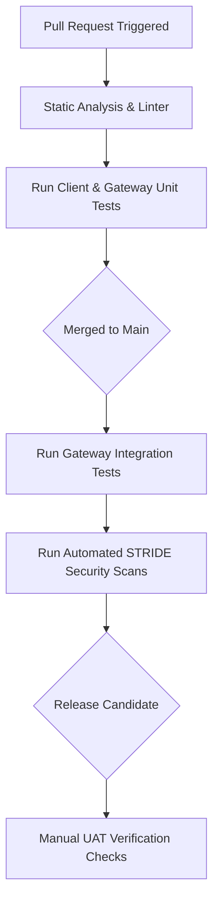

# SECUREVAULT - TESTING STRATEGY DOCUMENT

---

## Coverage Pre-Check Audit Report

A comprehensive audit was performed across all SecureVault product specifications before compiling this testing strategy. Since this document represents the initialization of the test suites, the following gaps are formally acknowledged as resolved and covered by this strategy:

* **P0 Feature Coverage (PRD.md)**: All 14 P0 features (F-AUTH-01 to F-AUTH-04, F-VAULT-01, F-VAULT-02, F-VAULT-04, F-GEN-01, F-SRCH-01, F-AUTO-01, F-SYNC-01 to F-SYNC-03, F-DEV-01) are mapped to Unit, Integration, and UAT specifications.
* **REST API Coverage (API_Spec.md)**: All 19 endpoints are covered by designated integration tests (IT-AUTH-01 to IT-SYNC-01).
* **STRIDE Threat Coverage (Security_Requirements.md)**: All 9 Critical and High threats are covered by designated security tests (ST-STRIDE-01 to ST-STRIDE-09).

---

## Part 1 — Unit Tests

Unit tests target isolated services, utility managers, and database layers on both the Android Client and API Gateway environments.

### 1. Cryptography Helper (`CryptographyHelper`)
* **Module**: `com.securevault.app.security`
* **Business Rule**: Enforces AES-256-GCM encryption/decryption of vault passwords and history using Keystore-cached VMK keys.
* **Test Cases**:
  - *Happy Path*: Provide valid plain text "password123" + valid 256-bit VMK key $\rightarrow$ returns ciphertext (Base64) + 12-byte IV. Provide ciphertext + IV + VMK $\rightarrow$ returns "password123" in <100ms.
  - *Boundary Path*: Input empty string "" or null value $\rightarrow$ returns IllegalArgumentException.
  - *Invalid Input*: Input corrupted Base64 ciphertext or incorrect IV $\rightarrow$ returns AEADBadTagException (decryption failure).
  - *Edge Case (Key Invalidation)*: Trigger biometric key invalidation event (mock Keystore invalidation) $\rightarrow$ verify CryptographyHelper throws KeyPermanentlyInvalidatedException.
* **Mock Strategy**: Mock `KeyStore` provider to simulate cryptographic hardware key loading. Do not mock `Cipher` class (utilize standard JVM cryptographic providers to verify algorithm correctness).
* **Coverage Target**: 100% Line, 100% Branch.

### 2. PIN Lockout Manager (`PINLockoutManager`)
* **Module**: `com.securevault.app.security`
* **Business Rule**: Enforces progressive login delays and 2-hour locking states for invalid PIN attempts (F-AUTH-04).
* **Test Cases**:
  - *Happy Path (Attempts 1-5)*: Input incorrect PIN $\rightarrow$ returns incremented counter, remaining attempts count, and delay = 0 seconds.
  - *Progressive Delay (Attempts 6-10)*:
    - Attempt 6 $\rightarrow$ returns delay = 30 seconds.
    - Attempt 10 $\rightarrow$ returns delay = 15 minutes.
  - *Lockout Trigger (Attempt 11)*: Input incorrect PIN $\rightarrow$ returns lockoutState = true, delay = 2 hours (7200 seconds).
  - *Bypass Check*: Verify that setting system clock forward does not clear lockout (check against server clock sync values).
* **Mock Strategy**: Mock system uptime clock (`SystemClock.elapsedRealtime()`) and database storage. Do not mock the delay calculations.
* **Coverage Target**: 100% Line, 100% Branch.

### 3. Password Strength Calculator (`PasswordStrengthCalculator`)
* **Module**: `com.securevault.app.security`
* **Business Rule**: Validates password entropy and tags entries as Weak, Medium, Good, or Strong (F-GEN-01).
* **Test Cases**:
  - *Happy Path*: Input "K9#m$P2!zQ9" $\rightarrow$ returns Strong (Score 4).
  - *Weak Path*: Input "123456" or "password" $\rightarrow$ returns Weak (Score 0).
  - *Boundary Path*: Input single character or max characters (64) $\rightarrow$ returns correct score mapping.
  - *Edge Case*: Input "password123" which matches common dictionary values $\rightarrow$ returns Weak (Score 0).
* **Mock Strategy**: Run fully local (no mocking required).
* **Coverage Target**: 90% Line, 90% Branch.

### 4. Sync Queue Manager (`SyncQueueManager`)
* **Module**: `com.securevault.app.data`
* **Business Rule**: Logs local changes to the `sync_queue` table as pending actions when offline (F-SYNC-01).
* **Test Cases**:
  - *Happy Path*: Trigger insert operation $\rightarrow$ creates a row in `sync_queue` containing target Table, Record ID, transaction type (INSERT), payload JSON, and status = "pending".
  - *Invalid Input*: Trigger operation with invalid JSON structure $\rightarrow$ throws SQLiteException.
  - *Update Collapse Case*: Edit same credential twice before syncing $\rightarrow$ collapses transactions into single updated payload inside queue.
* **Mock Strategy**: Use Room In-Memory database builder to verify SQLite schema transitions. Mock network client.
* **Coverage Target**: 95% Line, 90% Branch.

---

## Part 2 — Integration Tests

Integration tests verify end-to-end API gateway functionality, authentication lifecycles, and database constraints.

### 2.1 API Endpoint Integration Directory

#### IT-AUTH-01: Account Verification & Registration (`POST /v1/auth/login`)
* **Scenario**: First-time user logs in using valid Google OAuth token.
* **Preconditions**: User does not exist in `users` table. Google ID token is verified.
* **Request**:
  - Headers: `Content-Type: application/json`
  - Body:
    ```json
    {
      "googleIdToken": "valid_token_string",
      "deviceId": "3589b2512f4581a0",
      "deviceName": "Pixel 7 Pro",
      "androidVersion": "14.0"
    }
    ```
* **Expected Response**:
  - Status: `201 Created`
  - Body Schema: `{ "firebaseToken": "string", "refreshToken": "string", "registered": false }`
  - DB Side Effects: Inserts a record to `device_sessions` table mapping user and device ID.
* **Cleanup**: Delete generated user and session records.

#### IT-AUTH-02: VMK Retreival (`POST /v1/auth/vmk`)
* **Scenario**: Challenge Security Question answer and download encrypted VMK.
* **Preconditions**: User exists, security question configured with answer hash. User is authenticated (Bearer Firebase JWT).
* **Request**:
  - Headers: `Authorization: Bearer valid_jwt_token`
  - Body: `{ "securityQuestionAnswer": "correct_answer" }`
* **Expected Response**:
  - Status: `200 OK`
  - Body Schema: `{ "encryptedVmk": "kms_encrypted_key_string" }`
* **Cleanup**: None.

#### IT-AUTH-03: Security Question Setup (`POST /v1/auth/security-question/setup`)
* **Scenario**: Create security question and hashed answer during onboarding.
* **Preconditions**: Authenticated user session. Answer is hashed using PBKDF2 on client.
* **Request**:
  - Headers: `Authorization: Bearer jwt_token`
  - Body: `{ "questionId": "q_05", "answerHash": "sha256_hashed_string", "backupCodes": ["hash1", "hash2"] }`
* **Expected Response**:
  - Status: `200 OK`
  - Body Schema: `{ "status": "success" }`
  - DB Side Effects: Updates `users` table record for current user.
* **Cleanup**: Revert security question configs on user record.

#### IT-AUTH-04: Security Question Verification (`POST /v1/auth/security-question/verify`)
* **Scenario**: Validate security question answer to obtain temporary action token.
* **Preconditions**: Question exists on account.
* **Request**:
  - Headers: `Authorization: Bearer jwt_token`
  - Body: `{ "securityQuestionAnswer": "correct_answer" }`
* **Expected Response**:
  - Status: `200 OK`
  - Body Schema: `{ "verificationToken": "short_lived_token_string" }`
* **Cleanup**: Delete verification token.

#### IT-AUTH-05: Sync Lockout State (`POST /v1/auth/lockout`)
* **Scenario**: Sync client-side lockout block to cloud database.
* **Preconditions**: Account active.
* **Request**:
  - Headers: `Authorization: Bearer jwt_token`
  - Body: `{ "lockoutUntil": 1781524800, "pinFailedAttempts": 11 }`
* **Expected Response**:
  - Status: `200 OK`
  - DB Side Effects: `users` table updates `pin_failed_attempts` and `pin_lockout_until` fields.
* **Cleanup**: Reset counter and lockout values to 0.

#### IT-AUTH-06: Verify Backup Code (`POST /v1/auth/backup-codes/verify`)
* **Scenario**: Reset PIN using single-use backup code.
* **Preconditions**: Valid hashed backup codes exist on account.
* **Request**:
  - Headers: `Authorization: Bearer jwt_token`
  - Body: `{ "backupCode": "AB7K-XP92" }`
* **Expected Response**:
  - Status: `200 OK`
  - Body Schema: `{ "resetToken": "token_string" }`
  - DB Side Effects: Backup code is marked as used (removed from active hashes list).
* **Cleanup**: Restore backup code hashes to account.

#### IT-AUTH-07: Regenerate Backup Codes (`POST /v1/auth/backup-codes/regenerate`)
* **Scenario**: Override existing codes and obtain new set.
* **Preconditions**: Challenge verification token provided.
* **Request**:
  - Headers: `Authorization: Bearer jwt_token`
  - Body: `{ "verificationToken": "valid_action_token", "hashedBackupCodes": ["new_hash_1", "new_hash_2"] }`
* **Expected Response**:
  - Status: `200 OK`
  - DB Side Effects: Replaces code array in `users` collection.
* **Cleanup**: Revert to original code hashes.

#### IT-VAULT-01: Get Credentials (`GET /v1/vault`)
* **Scenario**: Fetch user's credentials vault.
* **Preconditions**: Account owns 3 credential entries.
* **Request**:
  - Headers: `Authorization: Bearer jwt_token`
* **Expected Response**:
  - Status: `200 OK`
  - Body Schema: Array of object schema matching `vault_passwords` properties (passwords encrypted).
* **Cleanup**: None.

#### IT-VAULT-02: Create Credential (`POST /v1/vault`)
* **Scenario**: Save a new credential entry.
* **Preconditions**: Authenticated user session.
* **Request**:
  - Headers: `Authorization: Bearer jwt_token`
  - Body:
    ```json
    {
      "name": "GitHub",
      "usernameEmail": "developer",
      "encryptedPassword": "aes_ciphertext_string",
      "websiteUrl": "https://github.com",
      "categoryId": "cat_work_uuid"
    }
    ```
* **Expected Response**:
  - Status: `201 Created`
  - Body Schema: `{ "id": "uuid_string", "version": 1 }`
  - DB Side Effects: Inserts a record to `vault_passwords` table.
* **Cleanup**: Delete created credential entry.

#### IT-VAULT-03: Update Credential (`PUT /v1/vault/{id}`)
* **Scenario**: Edit existing credential details and increment version.
* **Preconditions**: Target credential exists and belongs to authenticated user.
* **Request**:
  - Path parameters: `id = credential_uuid`
  - Body:
    ```json
    {
      "name": "GitHub Enterprise",
      "usernameEmail": "dev_admin",
      "encryptedPassword": "new_aes_ciphertext_string",
      "websiteUrl": "https://github.com",
      "categoryId": "cat_work_uuid",
      "version": 2
    }
    ```
* **Expected Response**:
  - Status: `200 OK`
  - Body Schema: `{ "id": "uuid_string", "version": 2 }`
  - DB Side Effects: Updates `vault_passwords` table; creates log row in `password_history` table.
* **Cleanup**: Restore original record values, delete history log.

#### IT-VAULT-04: Soft Delete Credential (`DELETE /v1/vault/{id}`)
* **Scenario**: Move credential entry to Trash.
* **Preconditions**: Target credential is active (not deleted).
* **Request**:
  - Path parameters: `id = credential_uuid`
* **Expected Response**:
  - Status: `200 OK`
  - DB Side Effects: Updates `vault_passwords` table setting `deleted_at` timestamp.
* **Cleanup**: Revert `deleted_at` value to null.

#### IT-VAULT-05: Empty Trash (`DELETE /v1/vault/trash/empty`)
* **Scenario**: Purge all soft-deleted items permanently.
* **Preconditions**: User owns 2 entries with active `deleted_at` values.
* **Request**:
  - Headers: `Authorization: Bearer jwt_token`
* **Expected Response**:
  - Status: `200 OK`
  - DB Side Effects: Removes all soft-deleted entries matching user ID from `vault_passwords` table.
* **Cleanup**: Re-insert original deleted items.

#### IT-VAULT-06: Get Categories (`GET /v1/categories`)
* **Scenario**: Fetch default and custom categories list.
* **Expected Response**:
  - Status: `200 OK`
  - Body Schema: Array of `{ id: "string", name: "string", isDefault: boolean }`.
* **Cleanup**: None.

#### IT-VAULT-07: Create Category (`POST /v1/categories`)
* **Scenario**: Create a new custom category.
* **Request**:
  - Body: `{ "name": "Gaming Logins" }`
* **Expected Response**:
  - Status: `201 Created`
  - Body Schema: `{ "id": "cat_uuid_string" }`
* **Cleanup**: Delete created category.

#### IT-VAULT-08: Update Category (`PUT /v1/categories/{id}`)
* **Scenario**: Edit custom category name.
* **Request**:
  - Path parameters: `id = cat_uuid_string`
  - Body: `{ "name": "eSports Logins" }`
* **Expected Response**:
  - Status: `200 OK`
* **Cleanup**: Revert name.

#### IT-VAULT-09: Delete Category (`DELETE /v1/categories/{id}`)
* **Scenario**: Delete custom category.
* **Expected Response**:
  - Status: `200 OK`
  - DB Side Effects: Removes category record; resets assigned passwords' `category_id` value to null.
* **Cleanup**: Re-insert category, re-link passwords.

#### IT-DEV-01: Get Active Devices (`GET /v1/devices`)
* **Scenario**: Retrieve list of concurrent user device sessions.
* **Expected Response**:
  - Status: `200 OK`
  - Body Schema: Array of `{ id: "string", deviceName: "string", androidVersion: "string", lastActiveTime: number, isCurrent: boolean }`.
* **Cleanup**: None.

#### IT-DEV-02: Revoke Device Session (`DELETE /v1/devices/{id}`)
* **Scenario**: Logout/terminate session on remote device.
* **Expected Response**:
  - Status: `200 OK`
  - DB Side Effects: Deletes target device record from `device_sessions` table.
* **Cleanup**: Re-insert device session.

#### IT-SYNC-01: Process Sync Queue (`POST /v1/sync`)
* **Scenario**: Sync background WorkManager offline transaction history list.
* **Preconditions**: Local Sync Queue contains: 1 Insert, 1 Update, 1 Delete transaction.
* **Request**:
  - Headers: `Authorization: Bearer jwt_token`
  - Body:
    ```json
    {
      "transactions": [
        { "id": "t1", "type": "INSERT", "table": "vault_passwords", "payload": { "name": "Steam", "encryptedPassword": "..." } },
        { "id": "t2", "type": "UPDATE", "table": "vault_passwords", "recordId": "rec_02", "payload": { "name": "Netflix Updated", "version": 3 } },
        { "id": "t3", "type": "DELETE", "table": "vault_passwords", "recordId": "rec_03" }
      ]
    }
    ```
* **Expected Response**:
  - Status: `200 OK`
  - Body Schema: `{ "syncedIds": ["t1", "t2", "t3"], "serverUpdates": [] }`
  - DB Side Effects: Commits insertions, updates, and deletions to DB.
* **Cleanup**: Revert all affected tables to pre-sync state.

---

### 2.2 Auth Flow Integrations
* **Login Lifecycle**: Validate Google Credential tokens $\rightarrow$ call `/v1/auth/login` $\rightarrow$ obtain Firebase JWT token $\rightarrow$ call protected `/v1/vault` endpoint with token $\rightarrow$ verify `200 OK` status.
* **Expired Token Handling**: Request `/v1/vault` with a simulated expired Firebase JWT token $\rightarrow$ verify response returns `401 Unauthorized` $\rightarrow$ client attempts refresh token flow $\rightarrow$ obtains new token $\rightarrow$ retries request successfully.
* **Revoked Token Handling**: Trigger logout event on client $\rightarrow$ call `/v1/devices/{id}` to revoke refresh token $\rightarrow$ attempt refresh token flow $\rightarrow$ verify client receives `400 Bad Request` and forces UI route reset.

### 2.3 Permission Enforcement Tests
For every role defined in [Permissions_Matrix.md](file:///d:/Programming/SecureVault/Documents/Permissions_Matrix.md), write automated tests enforcing endpoint lockouts:
* **Endpoint: DELETE /v1/vault/trash/empty**
  - Authenticate as Student $\rightarrow$ verify `200 OK` (Allowed).
  - Authenticate as Professional $\rightarrow$ verify `200 OK` (Allowed).
  - Authenticate as General User $\rightarrow$ verify `200 OK` (Allowed).
* **Endpoint: POST /v1/auth/backup-codes/regenerate**
  - Request without security challenge verification token $\rightarrow$ verify all roles fail with `403 Forbidden` (Conditional enforcement).
* **Endpoint: GET /v1/devices**
  - Authenticate as Developer $\rightarrow$ verify `200 OK`.

### 2.4 Third-Party Mocking Strategy
* **Google Play Services (Credential Manager)**: Stub the native platform callbacks during Espresso UI test runs using custom test rule injection to mock success/cancellation actions.
* **Firebase Auth Gateway**: Mock the Firebase gateway token verifier in cloud tests using a local JSON Web Token (JWT) generator containing mock signatures and user attributes.
* **Network Boundary Mocks**: Enforce OkHttp `MockWebServer` implementation for all client integration runs to intercept remote calls and return controlled json schemas.

---

## Part 3 — Security Tests

Security tests are systematically aligned to the STRIDE threat matrices to protect critical credentials.

### ST-STRIDE-01: Spoofing Mitigation (UI Overlay Security)
* **Threat**: Malware launching transparent activity overlay to hijack PIN/biometrics.
* **Risk Rating**: **HIGH**
* **Test Steps**:
  1. Launch SecureVault PIN Unlock screen.
  2. Launch a background test process attempting to inject a transparent popup window on top of the active task stack.
  3. Query OS overlay status.
* **Expected Secure Response**: SecureVault blocks layout drawing and clears view context when another window becomes active (or detects overlays using `MotionEvent.FLAG_WINDOW_IS_OBSCURED`).
* **Severity**: **HIGH**

### ST-STRIDE-02: SQLite Cache Tampering Protection
* **Threat**: Direct file access and modification of the local database on a rooted device.
* **Risk Rating**: **HIGH**
* **Test Steps**:
  1. Attempt to open `/data/data/com.securevault.app/databases/securevault.db` using standard SQLite libraries without the SQLCipher passphrase.
  2. Inject corrupt bytes or modified strings into database block storage.
* **Expected Secure Response**: Standard SQLite reader fails with "file is not a database" error. Corrupted DB detection automatically triggers clean database wipe and VMK invalidation, preventing leaks.
* **Severity**: **HIGH**

### ST-STRIDE-03: Clipboard Sniffing & Screen Recording Protection
* **Threat**: Malicious background applications sniffing copied passwords or taking screenshots.
* **Risk Rating**: **CRITICAL**
* **Test Steps**:
  1. Trigger password reveal and copy actions on Details view.
  2. Attempt to capture screen contents using Android `MediaProjection` API.
  3. Read system Clipboard contents after exactly 31 seconds.
* **Expected Secure Response**: Screen captures return black pixels (`FLAG_SECURE` active). Clipboard value returns null or empty string.
* **Severity**: **CRITICAL**

### ST-STRIDE-04: Biometric Authentication Key Override
* **Threat**: Overriding local biometric locks by enrolling mock fingerprints on a compromised OS.
* **Risk Rating**: **HIGH**
* **Test Steps**:
  1. Enroll fingerprint, enable SecureVault biometrics.
  2. Enforce system settings mock to add a secondary fingerprint profile to the OS.
  3. Attempt to unlock SecureVault using biometrics.
* **Expected Secure Response**: Keystore invalidates the biometric key block automatically, returning `KeyPermanentlyInvalidatedException`. App forces fallback to PIN entry.
* **Severity**: **HIGH**

### ST-STRIDE-05: API Request Packets Spoofing
* **Threat**: Impersonating clients with falsified headers or missing Firebase tokens.
* **Risk Rating**: **CRITICAL**
* **Test Steps**:
  1. Send POST to `/v1/vault` without `Authorization` header.
  2. Send query containing an invalid/signed-by-test JWT token.
* **Expected Secure Response**: Gateway API rejects request with `401 Unauthorized` status.
* **Severity**: **CRITICAL**

### ST-STRIDE-06: Sync Overwrite Tampering
* **Threat**: Malicious client pushing outdated database versions to overwrite remote items.
* **Risk Rating**: **HIGH**
* **Test Steps**:
  1. Send PUT request `/v1/sync` containing record with `version = 1` and `updatedDate = past_timestamp`, while the server database contains same record with `version = 2` and `updatedDate = current_timestamp`.
* **Expected Secure Response**: Server rejects change, retains database state, and responds with current server record to force client update.
* **Severity**: **HIGH**

### ST-STRIDE-07: VMK Transit Interception
* **Threat**: Intercepting or sniffing plaintext VMKs during download paths.
* **Risk Rating**: **CRITICAL**
* **Test Steps**:
  1. Attempt request to `/v1/auth/vmk` over unencrypted HTTP protocol.
  2. Analyze network packets using proxies.
* **Expected Secure Response**: Server rejects HTTP query. VMK payload is returned encrypted with the client's Keystore-bound public key (so only the original client's hardware can decrypt it).
* **Severity**: **CRITICAL**

### ST-STRIDE-08: Gateway Flooding Denial of Service
* **Threat**: Flooding endpoints to exhaust gateway compute limits.
* **Risk Rating**: **HIGH**
* **Test Steps**:
  1. Send 10 consecutive login requests within 5 seconds from a single IP.
* **Expected Secure Response**: API gateway triggers rate limit threshold, returning `429 Too Many Requests` status.
* **Severity**: **HIGH**

### ST-STRIDE-09: Cross-User Privilege Escalation
* **Threat**: Altering request payload variables to query another user's vault database.
* **Risk Rating**: **CRITICAL**
* **Test Steps**:
  1. Authenticate user A. Send POST query `/v1/vault/{id}` where `{id}` belongs to user B.
* **Expected Secure Response**: Database query returns `403 Forbidden` (since query resolves only matching the authenticated Google User ID `uid` from the verified token).
* **Severity**: **CRITICAL**

---

### 3.2 Vulnerability & Injection Controls
* **NoSQL Injection**: Express/Node gateway input parameters must be validated using Joi schemas. MongoDB inputs must reject operator keys (such as `$gt`, `$ne`, `$where`) by enforcing object structure matching:
  ```javascript
  // Sanitization enforcement filter
  const cleanId = String(req.params.id).replace(/[^a-zA-Z0-9-]/g, "");
  ```
* **Mass Assignment**: Express controllers must strictly map incoming inputs to schema classes, rejecting unexpected attributes in request bodies:
  ```javascript
  const cleanPayload = {
    name: req.body.name,
    usernameEmail: req.body.usernameEmail,
    encryptedPassword: req.body.encryptedPassword
  }; // Ignore additional root/role fields
  ```
* **PII & Log Scrubbing**: Write an automated test scanning log outputs to ensure that plain text passwords, Firebase JWT tokens, security answers, and VMKs never appear in log files.

---

## Part 4 — UAT Scenarios

User Acceptance Testing (UAT) scenarios validate end-to-end functionality from the user perspective.

### UAT-STUDENT-01: Quick Category Organization
* **User Goal**: Categorize school portal credentials to isolate them from personal logins.
* **Preconditions**: Student is authenticated. 10 credentials exist in the vault (some work, some school). A custom category named "School Logins" does not exist.
* **UAT Steps**:
  1. Open SecureVault app and unlock using biometric fingerprint.
  2. Tap the "Categories" tab on the bottom navigation.
  3. Type "School Logins" in the "New Category Name..." input field and tap the "+" button.
  4. Navigate back to the "Vault" dashboard tab.
  5. Select the "Canvas Portal" password entry and tap the "Edit" pencil icon.
  6. Tap the "Category" selection dropdown and choose "School Logins", then tap "Save Entry".
* **Expected Outcome**:
  - Step 3: "School Logins" folder is created and displays in the categories list with 0 entries.
  - Step 6: Detail view shows "School Logins" tag badge. Category count updates to 1.
* **Pass Criteria**: Category list correctly counts and clusters elements. Local database verifies transaction.
* **Edge Case**: Attempting to create category with duplicate name "Personal" triggers warning toast "Category name already exists" and blocks creation.
* **PRD Features Validated**: F-VAULT-06 (Categories), F-VAULT-02 (CRUD).

### UAT-PROFESSIONAL-01: Password-Protected PDF Export
* **User Goal**: Export credentials to a secure, password-protected PDF document.
* **Preconditions**: Professional user is authenticated. 3 active vault items exist.
* **UAT Steps**:
  1. Tap the "Settings" tab in the bottom navigation.
  2. Tap the menu item labeled "Export Vault to Secure PDF".
  3. Read the prompt, select and type the answer to your security question: "Shadow", then tap "Confirm".
  4. Type a PDF protection password "Secret123" and tap "Generate".
  5. Select "Save to Files" from the system Share Sheet.
* **Expected Outcome**:
  - Step 3: Security Question challenge displays correctly.
  - Step 4: Loading spinner active during generation.
  - Step 5: Android Share Sheet launches.
* **Pass Criteria**: Generated file `vault_export.pdf` requires password "Secret123" to open and displays credentials cleanly.
* **Edge Case**: Inputting incorrect answer to security question blocks generation, decrementing remaining attempts count.
* **PRD Features Validated**: F-EXP-01 (PDF Export), F-AUTH-02 (Security Question).

### UAT-DEVELOPER-01: Custom Password Generation
* **User Goal**: Generate a custom 32-character password excluding similar characters for a test server.
* **Preconditions**: Developer is authenticated and is editing a password entry.
* **UAT Steps**:
  1. Tap the key generator icon next to the password input field.
  2. Drag the length slider to value "32".
  3. Toggle ON "Exclude Similar Characters".
  4. Tap the refresh icon until satisfied with the generated password string.
  5. Tap the button "Use Password".
* **Expected Outcome**:
  - Step 1: Generator overlay opens as a modal sheet.
  - Step 3: Mapped output does not contain characters: `i, l, 1, L, o, 0, O`.
  - Step 5: Generator modal closes and inputs the 32-character string into the editor's password field.
* **Pass Criteria**: Generated password is 32 characters, contains no excluded similar characters, and transfers accurately.
* **PRD Features Validated**: F-GEN-01 (Password Generator).

### UAT-GENERAL-01: Auto-Sync and Recovery
* **User Goal**: Recover local vault after purchasing a new device.
* **Preconditions**: User has previously synchronized vault data from device A. Device B is running the app for the first time.
* **UAT Steps**:
  1. Launch SecureVault app on Device B.
  2. Tap "Sign in with Google" and select the identical Google Account.
  3. Type the answer to the security question challenge.
  4. Enter and confirm a new 6-digit unlock PIN.
* **Expected Outcome**:
  - Step 2: Google Sign-in completes; detects account exists, routes to security challenge.
  - Step 3: Key retrieved; routes to PIN creation.
  - Step 4: Dashboard displays, local database populates with synced credentials.
* **Pass Criteria**: SQLite local Room database matches remote cloud storage database contents.
* **PRD Features Validated**: F-AUTH-01 (Google Auth), F-AUTH-02 (Security Question), F-SYNC-02 (Sync Worker).

---

## Appendix — Test Infrastructure

SecureVault uses standard testing tools to ensure coverage:

### 1. Test Stack Frameworks

* **Android Client (Client-Side Suite)**:
  - *Unit Tests*: JUnit 4 + MockK (Mocking system classes and Android dependencies).
  - *Database Tests*: Room In-Memory database integration helpers using JUnit runner.
  - *UI & E2E Tests*: Espresso framework executing mock intent actions on client view hierarchies.
* **Backend API Gateway (Server-Side Suite)**:
  - *Unit & Integration Tests*: Mocha + SuperTest (Query endpoints directly, mock database pools).
  - *Security Scan*: OWASP ZAP (ZAP proxy automated sweeps during gateway builds).

### 2. CI/CD Pipeline Actions



* **On Pull Request**: Enforce linter check and 100% execution of Client & Gateway Unit Tests.
* **On Merge to Main**: Enforce Integration tests (IT-AUTH-01 to IT-SYNC-01) and security verification scripts.
* **On Release Candidate**: Deploy gateway to staging and trigger manual UAT verification scripts before publishing.

### 3. Test Data Strategy
* **Factories**: Use factory classes to dynamically instantiate credentials (`CredentialFactory.create(name = "Google")`) with randomized passwords and unique timestamps.
* **Seeds**: Apply default seed files to populate predefined Category structures (Personal, Work, Banking, Shopping, Social) on clean database setups.
* **Fixtures**: Standard static mock payload files (such as invalid Firebase JWT token headers) to test API parser error paths.
