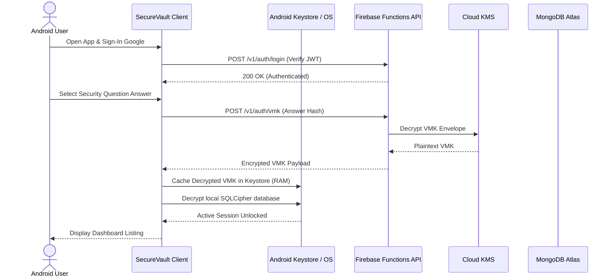

# 🛡️ SecureVault

**SecureVault** is a modern, offline-first, cloud-synchronized Android native password manager. Built with a focus on defense-in-depth security, low-latency performance, and clean Material 3 design, it ensures credentials remain isolated, encrypted, and accessible at all times.

---

## 🚀 Key Features

* **🔑 Google Sign-In & Secure Key Exchange**
  * Authenticates sessions using Android's modern `Credential Manager` API.
  * Encrypted Vault Master Keys (VMK) are cached dynamically in the hardware-backed `Android Keystore` (never written to disk).
* **🔒 Room + SQLCipher Local Cache**
  * 100% offline access to passwords, categories, and histories.
  * Local SQLite database file encrypted at rest using `SQLCipher` AES-256 block protection.
* **📲 Android Autofill Service**
  * Fast credential overlay suggestions inside native input fields and WebViews.
* **🔄 Background Synchronization Worker**
  * Transactions write to a local `Sync Queue` when offline.
  * Pushed automatically via an Android `WorkManager` background task when internet connectivity returns.
* **🛡️ Security Lockouts & Safeguards**
  * Progressive entry delays and 2-hour locking states for PIN entries to block brute-force attacks.
  * System-wide biometric invalidation (new fingerprint checks force fallback authentication).
  * System-level clipboard clearing after 30 seconds and screenshot/recording blocks.
* **🚨 Threat Aware Environment**
  * Immediate detection and warning alerts if running on a rooted device or if USB debugging is active.

---

## 🛠️ Technology Stack

| Component | Technology | Target Version |
| :--- | :--- | :---: |
| **Language** | Kotlin | `1.9.22` |
| **UI Framework** | Material 3 | `1.2.0` |
| **Local Cache** | Room Database | `2.6.1` |
| **Database Encryption** | SQLCipher | `4.5.4` |
| **Identity / Auth** | Firebase Authentication | `22.3.1` |
| **Autofill Hook** | Android Autofill Framework | Native (API 26+) |
| **Background Queue** | Android WorkManager | `2.9.0` |
| **Backend Gateway** | Firebase Cloud Functions | Node.js v20 |
| **Cloud Database** | MongoDB Atlas | MongoDB 6.0+ |

---

## 📂 Project Directory Structure

```
SecureVault/
│
├── android-client/                  # Kotlin Android application module
│   ├── app/
│   │   ├── build.gradle.kts
│   │   └── src/
│   │       └── main/
│   │           ├── AndroidManifest.xml
│   │           └── java/com/securevault/app/
│   │               ├── data/        # Models, Room Entities, DAOs, SyncQueue
│   │               ├── di/          # Dependency Injection (Hilt/Koin)
│   │               ├── security/    # Keystore helpers, Cryptography (AES, SQLCipher)
│   │               ├── service/     # AutofillService implementation
│   │               ├── ui/          # ViewModels, Material 3 Composable screens
│   │               └── worker/      # WorkManager Sync Workers
│   └── build.gradle.kts
│
├── backend-gateway/                 # Firebase Cloud Functions (Node.js API)
│   └── functions/
│       ├── index.js                 # API gateway entry point
│       └── package.json
│
└── Documents/                       # Comprehensive specifications stack
```

---

## 📐 Architecture Overview

SecureVault uses a hybrid server-assisted, locally-encrypted model:



---

## 🛠️ Getting Started (Prerequisites)

### Android Client
* Android Studio Iguana (or newer)
* Android SDK Platform version 34 (Android 14)
* Min SDK: API level 26

### Backend Gateway
* Node.js v20 LTS
* Firebase CLI
* MongoDB Atlas cluster connection uri
